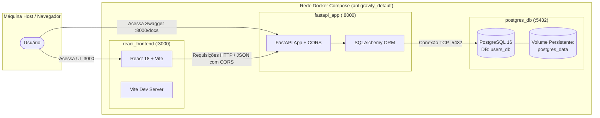

# 📋 Contexto Geral do Projeto: Sistema de Cadastro de Usuários (CRUD)

> **Documento de Contexto e Arquitetura**  
> **Última atualização:** 06 de Setembro de 2026  
> **Status:** Concluído, testado e em execução via Docker Compose.

---

## 1. 🎯 Visão Geral e Objetivo

Este projeto é uma aplicação web fullstack com arquitetura moderna e containerizada para gerenciamento completo (**CRUD**) de cadastro de usuários. O sistema foi desenvolvido do zero seguindo boas práticas de modularidade, validação em múltiplas camadas, persistência relacional, design de interface limpo (*clean design*) e cobertura abrangente de testes.

### 🛠️ Stack Tecnológica

| Camada | Tecnologia | Descrição / Papel |
|---|---|---|
| **Backend** | Python 3.11 / FastAPI | Framework web de alta performance para criação de APIs REST assíncronas. |
| **ORM / Banco** | SQLAlchemy 2.0 / PostgreSQL 16 | Mapeamento objeto-relacional e banco de dados relacional com volume persistente. |
| **Validação Backend**| Pydantic v2 / email-validator | Schemas com validação estrita de dados e formatos de e-mail. |
| **Frontend** | React 18 / Vite 5 | SPA (Single Page Application) moderna, rápida e responsiva. |
| **Estilização** | CSS puro com Design Tokens | Visual *clean*, tipografia *Inter*, paleta neutra com acentos em azul royal, microinterações e transições suaves. |
| **Ícones** | Lucide React | Conjunto de ícones leves e minimalistas. |
| **Containerização**| Docker & Docker Compose | Orquestração integrada de banco, backend e frontend. |
| **Testes Frontend**| Vitest + React Testing Library | Testes unitários, de componentes e de integração do fluxo de tela. |
| **Testes E2E / API**| Playwright / Scripts Python | Validações automatizadas ponta a ponta e integração de API. |

---

## 2. 🏛️ Arquitetura do Sistema



---

## 3. 📂 Estrutura Completa de Diretórios e Arquivos

```text
/home/guilhermemorais/antigravity/
├── app/                              # Módulo do Backend (FastAPI)
│   ├── __init__.py                   # Inicialização do pacote Python
│   ├── database.py                   # Engine, SessionLocal e Base do SQLAlchemy
│   ├── models.py                     # Modelo User mapeado no PostgreSQL
│   ├── schemas.py                    # Schemas Pydantic (Create, Update, Response)
│   └── main.py                       # Rotas da API, CORS e ciclo de vida
│
├── frontend/                         # Aplicação Frontend (React + Vite)
│   ├── e2e/
│   │   └── users-crud.spec.js        # Testes E2E com Playwright
│   ├── src/
│   │   ├── components/               # Componentes reutilizáveis
│   │   │   ├── DeleteConfirmModal.jsx      # Modal seguro de exclusão
│   │   │   ├── DeleteConfirmModal.test.jsx # Teste do modal de exclusão
│   │   │   ├── Navbar.jsx                  # Cabeçalho, contador e status
│   │   │   ├── Navbar.test.jsx             # Teste da Navbar
│   │   │   ├── Toast.jsx                   # Notificações visuais flutuantes
│   │   │   ├── Toast.test.jsx              # Teste do Toast
│   │   │   ├── UserFormModal.jsx           # Formulário de criação e edição
│   │   │   ├── UserFormModal.test.jsx      # Teste do formulário com validação
│   │   │   ├── UserTable.jsx               # Tabela responsiva com avatares
│   │   │   └── UserTable.test.jsx          # Teste da tabela de usuários
│   │   ├── services/
│   │   │   ├── api.js                # Cliente de consumo HTTP dos endpoints
│   │   │   └── api.test.js           # Testes unitários do cliente HTTP
│   │   ├── utils/
│   │   │   ├── formatters.js         # Funções de formatação (iniciais, datas)
│   │   │   └── formatters.test.js    # Testes unitários das formatações
│   │   ├── App.jsx                   # Componente central com gerenciamento de estado
│   │   ├── App.integration.test.jsx  # Teste de integração do fluxo completo da UI
│   │   ├── index.css                 # Folha de estilo clean/moderna global
│   │   ├── main.jsx                  # Ponto de montagem React no DOM
│   │   └── setupTests.js             # Configuração do jest-dom para o Vitest
│   ├── Dockerfile                    # Imagem Node 20 para o frontend
│   ├── index.html                    # HTML principal com fonte Inter
│   ├── package.json                  # Dependências e scripts do frontend
│   ├── playwright.config.js          # Configuração do Playwright
│   └── vite.config.js                # Configuração do Vite e Vitest
│
├── .dockerignore                     # Ignora arquivos desnecessários no build do app
├── .env.example                      # Variáveis de ambiente de exemplo
├── .gitignore                        # Regras de ignore do Git
├── CONTEXTO.md                       # Este documento de contexto
├── Dockerfile                        # Imagem Python 3.11 para a API FastAPI
├── docker-compose.yml                # Orquestrador dos serviços db, app e frontend
├── README.md                         # Documentação principal e guia de uso
├── requirements.txt                  # Dependências Python do backend
├── test_app.py                       # Teste de integração da API em Python
└── test_e2e.py                       # Teste ponta a ponta (E2E) dos 3 serviços
```

---

## 4. ⚙️ Detalhamento do Backend (FastAPI + PostgreSQL)

### 4.1 Modelo de Dados (`app/models.py`)
Tabela `users`:
- `id` (`Integer`, Primary Key, Index): Identificador numérico auto-incremental.
- `name` (`String(100)`, Not Null): Nome completo do usuário.
- `email` (`String(100)`, Unique, Index, Not Null): E-mail único obrigatório.
- `created_at` (`DateTime(timezone=True)`, server_default=`func.now()`): Timestamp de registro.

### 4.2 Esquemas Pydantic (`app/schemas.py`)
- `UserBase`: Campos base (`name`, `email: EmailStr`).
- `UserCreate`: Payload para criação de usuário.
- `UserUpdate`: Campos opcionais (`name: Optional[str]`, `email: Optional[EmailStr]`).
- `UserResponse`: Retorno serializado com `id`, `created_at` e `from_attributes = True`.

### 4.3 Endpoints e Regras de Negócio (`app/main.py`)

| Método | Rota | Status Code | Descrição e Validações |
|---|---|---|---|
| `GET` | `/` | `200 OK` | Mensagem de boas-vindas e link para `/docs`. |
| `POST` | `/users/` | `201 Created` | Cria usuário. Valida formato de e-mail e impede duplicação (retorna `400 Bad Request` se já existir). |
| `GET` | `/users/` | `200 OK` | Listagem com parâmetros de paginação `skip` (default: 0) e `limit` (default: 100). |
| `GET` | `/users/{id}` | `200 OK` | Busca por ID. Retorna `404 Not Found` caso o usuário não exista. |
| `PUT` | `/users/{id}` | `200 OK` | Atualiza dados. Valida se o novo e-mail já pertence a outro usuário cadastrado. |
| `DELETE` | `/users/{id}` | `204 No Content` | Remove o usuário do banco. Retorna `404 Not Found` se não existir. |

### 4.4 Middleware de CORS
Configurado via `CORSMiddleware` no FastAPI para habilitar comunicação direta com o frontend React (`http://localhost:3000`), permitindo métodos `GET`, `POST`, `PUT`, `DELETE` e `OPTIONS`.

---

## 5. 💻 Detalhamento do Frontend (React + Vite)

### 5.1 Design System e Princípios Visuais
- **Identidade Visual:** Minimalista, limpa e profissional.
- **Tipografia:** Fonte `Inter` importada do Google Fonts.
- **Cores Principais:**
  - Fundo principal: `#f8fafc` (slate sutil).
  - Superfícies/Cards: `#ffffff` com bordas `#e2e8f0` e sombras suaves.
  - Primária: Azul Royal `#2563eb` (hover: `#1d4ed8`).
  - Sucesso: `#10b981` (badge online e toasts).
  - Perigo: `#ef4444` (exclusão e alertas de erro).
- **Responsividade:** Layout adaptável para telas móveis e desktops.

### 5.2 Componentes e Responsabilidades
1. **`Navbar`**: Exibe o logotipo, contador dinâmico de usuários cadastrados e badge de status da conexão com a API.
2. **`UserTable`**: Tabela com avatar gerado a partir das iniciais do usuário, ID, e-mail, data formatada em `pt-BR` e botões de ação com ícones. Inclui estados de *loading* e *empty state*.
3. **`UserFormModal`**: Modal responsivo com formulário para cadastro e edição de usuários, com validação de preenchimento e regex de e-mail.
4. **`DeleteConfirmModal`**: Modal de segurança para confirmar antes de realizar a remoção permanente de um usuário.
5. **`Toast`**: Sistema flutuante de notificações para feedback imediato (auto-dismiss após 4 segundos).

---

## 6. 🧪 Pirâmide de Testes Implementada

O projeto conta com **4 camadas completas de testes**, todas verificadas e com 100% de sucesso:

```text
               ▲
              / \
             /E2E\        -> test_e2e.py & Playwright (fluxo completo navegador/API/DB)
            /-----\
           / Inte- \      -> App.integration.test.jsx & test_app.py (FastAPI + DB)
          /  gração \
         /-----------\
        / Componentes \   -> Navbar, Toast, UserTable, UserFormModal, DeleteConfirmModal
       /---------------\
      /    Unitários    \ -> formatters.test.js & api.test.js
     ---------------------
```

### Resumo dos Resultados dos Testes

1. **Testes do Frontend (Vitest + React Testing Library):**
   - **Total:** 8 arquivos de teste, **40 testes executados, 40 aprovados**.
   - Comando: `docker compose exec frontend npm test`

2. **Testes de Integração da API (Python):**
   - **Total:** 14 asserções validando status codes `200`, `201`, `400`, `404`, `422` e `204`.
   - Comando: `python3 test_app.py`

3. **Testes Ponta a Ponta (E2E):**
   - Valida entrega do HTML no React, bundle do Vite, preflight CORS e jornada completa de usuário no PostgreSQL.
   - Comando: `python3 test_e2e.py`

---

## 7. 🚀 Guia de Operação e Comandos Úteis

### 7.1 Inicialização dos Serviços
```bash
docker compose up -d --build
```

### 7.2 Endereços de Acesso
- **Frontend React:** [http://localhost:3000](http://localhost:3000)
- **Documentação Swagger:** [http://localhost:8000/docs](http://localhost:8000/docs)
- **Documentação ReDoc:** [http://localhost:8000/redoc](http://localhost:8000/redoc)
- **PostgreSQL:** `localhost:5432` (Usuário: `postgres`, Banco: `users_db`)

### 7.3 Execução dos Testes
```bash
# Testes do Frontend (Unitários + Componentes + Integração)
docker compose exec frontend npm test

# Testes de Integração da API Backend
python3 test_app.py

# Testes E2E (Ponta a Ponta)
python3 test_e2e.py
```

### 7.4 Parada e Limpeza dos Serviços
```bash
# Parar os containers mantendo os dados salvos
docker compose down

# Parar os containers e remover volumes do banco de dados
docker compose down -v
```
