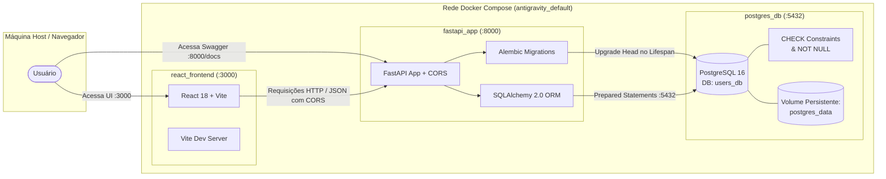

# 📋 Contexto Geral do Projeto: Sistema de Cadastro de Usuários & Autenticação OAuth2 (CRUD)

> **Documento de Contexto e Arquitetura**  
> **Última atualização:** 09 de Setembro de 2026  
> **Status:** Concluído, testado com 100% de aprovação (TDD), com autenticação OAuth2 (GitHub & Google), validações nativas no banco e em execução via Docker Compose.

---

## 1. 🎯 Visão Geral e Objetivo

Este projeto é uma aplicação web fullstack com arquitetura moderna e containerizada para gerenciamento completo (**CRUD**) de cadastro de usuários e **autenticação federada OAuth 2.0 com suporte a GitHub e Google (Gmail)**. O sistema segue práticas estritas de modularidade, separação de responsabilidades, validação em duas camadas (Backend via Pydantic e Banco de Dados via PostgreSQL CHECK Constraints), migrações versionadas com Alembic, blindagem integral contra **SQL Injection**, **Script Injection (XSS)**, **CSRF / State Tampering** e **Ataques contra JWT (Alg: None)**, persistência relacional, design de interface limpo (*clean design*) e cobertura de testes seguindo **TDD (Test-Driven Development)**.

### 🛠️ Stack Tecnológica

| Camada | Tecnologia | Descrição / Papel |
|---|---|---|
| **Backend** | Python 3.11 / FastAPI | Framework web de alta performance para criação de APIs REST assíncronas com OpenAPI 3.1. |
| **Autenticação** | OAuth 2.0 / PyJWT / httpx | Fluxo de autorização federado com GitHub e Google, emissão de JWT (HS256) e State anti-CSRF com HMAC-SHA256. |
| **ORM / Banco** | SQLAlchemy 2.0 / PostgreSQL 16 | Mapeamento objeto-relacional com consultas 100% parametrizadas, tabela relacional `oauth_accounts` e volume persistente. |
| **Migrações** | Alembic 1.19 | Gerenciamento versionado e automatizado de DDL e restrições de integridade no banco. |
| **Validação Backend**| Pydantic v2 / email-validator | Schemas com validação estrita de dados, algoritmo de CPF, formato de CEP e telefone. |
| **Validação DB** | PostgreSQL CHECK Constraints | Restrições nativas de integridade de dados e validações regex executadas pela engine do banco. |
| **Observabilidade** | Prometheus / prometheus-client | Métricas de vazão (Throughput), histograma de latência, conexões ativas, contadores de CRUD e eventos OAuth2 com OpenMetrics. |
| **Frontend** | React 18 / Vite 5 | SPA (Single Page Application) moderna, rápida e responsiva com microinterações. |
| **Gestão de Auth UI**| React AuthContext | Gerenciamento reativo de sessão, interceptação de token hash (`#token=`), captura resiliente de erros (`#auth_error=`) e persistência. |
| **Estilização** | CSS puro com Design Tokens | Visual *clean*, tipografia *Inter*, modais estruturados em seções e design responsivo. |
| **Ícones** | Lucide React | Conjunto de ícones leves e minimalistas. |
| **Containerização**| Docker & Docker Compose | Orquestração integrada de banco, backend, frontend e servidor Prometheus com reload instantâneo. |
| **Testes Frontend**| Vitest + React Testing Library | 13 arquivos de testes (84 testes) cobrindo formatters, componentes, tela de login dedicada, botões OAuth, responsividade mobile/tablet, modais, AuthContext e integração de UI. |
| **Testes Backend** | Python unittest | 58 testes cobrindo schemas, CPF, CEP, idade, regras OAuth2, observabilidade Prometheus e testes de segurança (SQLi, XSS, CSRF, JWT, Provider Errors). |
| **Testes E2E / API**| Scripts Python automatizados | Testes de integração de API (`test_app.py` com 16 validações), E2E geral (`test_e2e.py`) e E2E de segurança/OAuth (`test_e2e_auth.py` com 8 etapas). |


---

## 2. 🏛️ Arquitetura do Sistema



---

## 3. 📂 Estrutura Completa de Diretórios e Arquivos

```text
/home/guilermiii/github/antigravity/
├── alembic/                          # Migrações versionadas de banco de dados
│   ├── env.py                        # Integração do Alembic com SQLAlchemy e PostgreSQL
│   ├── script.py.mako                # Template de criação de novas migrations
│   └── versions/                     # Histórico de migrations
│       └── 001_expand_users_and_add_constraints.py # Migration com novas colunas e CHECK constraints
├── alembic.ini                       # Configuração global do Alembic
│
├── app/                              # Módulo do Backend (FastAPI)
│   ├── __init__.py                   # Inicialização do pacote Python
│   ├── database.py                   # Engine, SessionLocal e Base do SQLAlchemy
│   ├── metrics.py                    # Telemetria Prometheus, middleware HTTP e endpoints /metrics e /health
│   ├── models.py                     # Modelo User com novas colunas e CheckConstraints
│   ├── schemas.py                    # Schemas Pydantic v2 (Create, Update, Response)
│   ├── validators.py                 # Funções puras de validação (CPF módulo 11, CEP, Telefone)
│   └── main.py                       # Rotas da API, middleware Prometheus e Swagger
│
├── frontend/                         # Aplicação Frontend (React + Vite)
│   ├── e2e/
│   │   └── users-crud.spec.js        # Testes E2E com Playwright
│   ├── src/
│   │   ├── components/               # Componentes reutilizáveis
│   │   │   ├── AuthButtons.jsx             # Botões de Login OAuth2 compactos e grandes
│   │   │   ├── AuthButtons.test.jsx        # Testes dos botões OAuth
│   │   │   ├── DeleteConfirmModal.jsx      # Modal seguro de confirmação de exclusão
│   │   │   ├── DeleteConfirmModal.test.jsx # Testes do modal de exclusão
│   │   │   ├── LoginScreen.jsx             # Tela de Login dedicada (OAuth2 GitHub/Google, badges, perfil)
│   │   │   ├── LoginScreen.test.jsx        # Testes unitários com mocks da LoginScreen
│   │   │   ├── Navbar.jsx                  # Cabeçalho com status, ambiente DEV, login e perfil
│   │   │   ├── Navbar.test.jsx             # Testes da Navbar
│   │   │   ├── ResponsiveUI.test.jsx       # Testes de responsividade mobile/tablet
│   │   │   ├── Toast.jsx                   # Notificações visuais flutuantes
│   │   │   ├── Toast.test.jsx              # Testes do Toast
│   │   │   ├── UserDetailModal.jsx         # Modal de exibição da ficha cadastral completa
│   │   │   ├── UserDetailModal.test.jsx    # Testes do modal de detalhes
│   │   │   ├── UserFormModal.jsx           # Formulário com grid, seções e máscaras
│   │   │   ├── UserFormModal.test.jsx      # Testes do formulário (obrigatórios vs opcionais)
│   │   │   ├── UserTable.jsx               # Tabela responsiva com iniciais, contato e ações
│   │   │   └── UserTable.test.jsx          # Testes da tabela de usuários
│   │   ├── services/
│   │   │   ├── api.js                # Cliente de consumo HTTP dos endpoints REST
│   │   │   └── api.test.js           # Testes unitários do cliente HTTP
│   │   ├── utils/
│   │   │   ├── formatters.js         # Formatadores (iniciais nome/sobrenome, CPF, Telefone, CEP, datas)
│   │   │   └── formatters.test.js    # Testes unitários das formatações
│   │   ├── App.jsx                   # Componente central com gerenciamento de estado e modais
│   │   ├── App.integration.test.jsx  # Teste de integração do fluxo completo da UI
│   │   ├── index.css                 # Folha de estilo clean/moderna global
│   │   ├── main.jsx                  # Ponto de montagem React no DOM
│   │   └── setupTests.js             # Configuração do jest-dom para o Vitest
│   ├── Dockerfile                    # Imagem Node 20 para o frontend
│   ├── index.html                    # HTML principal com fonte Inter
│   ├── package.json                  # Dependências e scripts do frontend
│   ├── playwright.config.js          # Configuração do Playwright
│   └── vite.config.js                # Configuração do Vite e Vitest
│
├── prometheus/                       # Configuração do Prometheus Server
│   └── prometheus.yml                # Job de scrape a cada 10s no backend FastAPI
│
├── tests/                            # Suíte de Testes Unitários do Backend
│   ├── __init__.py
│   ├── test_metrics.py               # 8 testes de observabilidade, métricas e probes
│   ├── test_unit.py                  # 17 testes unitários (Pydantic, CPF, CEP, idade, Anti-SQLi)
│   ├── test_auth_unit.py             # 12 testes de validação unitária de auth
│   ├── test_auth_security.py         # 10 testes de penetração JWT e CSRF
│   └── test_auth_integration.py      # 7 testes de fluxo OAuth2 integrado com mocks
│
├── .dockerignore                     # Ignora arquivos desnecessários no build do app
├── .env.example                      # Variáveis de ambiente de exemplo
├── .gitignore                        # Regras de ignore do Git
├── CONTEXTO.md                       # Este documento de contexto e arquitetura
├── Dockerfile                        # Imagem Python 3.11 para a API FastAPI
├── docker-compose.yml                # Orquestrador dos serviços db, app, frontend e prometheus
├── README.md                         # Documentação principal e guia de uso
├── requirements.txt                  # Dependências Python do backend (com prometheus-client)
├── test_app.py                       # Testes de integração da API em Python (16 validações)
├── test_e2e.py                       # Teste ponta a ponta (E2E) dos serviços
└── test_e2e_auth.py                  # Teste ponta a ponta E2E dos fluxos OAuth2

```

---

## 4. ⚙️ Detalhamento do Backend (FastAPI + PostgreSQL)

### 4.1 Modelo de Dados (`app/models.py`)
Tabela `users`:
- `id` (`Integer`, Primary Key, Index): Identificador numérico auto-incremental.
- `nome` (`String(100)`, Not Null): Primeiro nome (mínimo 2 caracteres).
- `sobrenome` (`String(100)`, Not Null): Sobrenome do usuário (mínimo 2 caracteres).
- `email` (`String(150)`, Unique, Index, Not Null): E-mail único obrigatório.
- `telefone` (`String(20)`, Nullable): Telefone com DDD no padrão `(XX) XXXXX-XXXX`.
- `idade` (`Integer`, Nullable): Idade em anos (entre 0 e 150).
- `genero` (`String(50)`, Nullable): Identidade de gênero.
- `cpf` (`String(14)`, Index, Nullable): CPF válido com 11 dígitos numéricos.
- `rua` (`String(200)`, Nullable): Logradouro.
- `numero` (`String(20)`, Nullable): Número residencial.
- `cidade` (`String(100)`, Nullable): Cidade.
- `estado` (`String(50)`, Nullable): Estado ou UF.
- `cep` (`String(20)`, Nullable): CEP no formato `00000-000`.
- `pais` (`String(100)`, Nullable, Default="Brasil"): País de residência.
- `escolaridade` (`String(100)`, Nullable): Grau de formação.
- `created_at` (`DateTime(timezone=True)`, server_default=`func.now()`): Timestamp de cadastro.

#### Restrições Nativas no PostgreSQL (CHECK Constraints):
- `check_nome_valido`: `length(trim(nome)) >= 2`
- `check_sobrenome_valido`: `length(trim(sobrenome)) >= 2`
- `check_email_formato`: `email ~* '^[A-Za-z0-9._%+-]+@[A-Za-z0-9.-]+\\.[A-Za-z]{2,}$'`
- `check_idade_valida`: `idade IS NULL OR (idade >= 0 AND idade <= 150)`
- `check_cpf_valido`: `cpf IS NULL OR (cpf ~ '^[0-9]{11}$')`
- `check_cep_valido`: `cep IS NULL OR (cep ~ '^[0-9]{5}-[0-9]{3}$')`
- `check_telefone_valido`: `telefone IS NULL OR (length(telefone) >= 10 AND length(telefone) <= 20)`

### 4.2 Esquemas Pydantic (`app/schemas.py`)
- `UserBase`: Campos base com anotações ricas do OpenAPI, exemplos e validadores `@field_validator`.
- `UserCreate`: Payload para criação de usuário (apenas `nome`, `sobrenome` e `email` obrigatórios).
- `UserUpdate`: Atualização atômica ou parcial com campos opcionais.
- `UserResponse`: Retorno serializado com `id`, `created_at` e `from_attributes = True`.

### 4.3 Endpoints e Regras de Negócio (`app/main.py`)

| Método | Rota | Status Code | Descrição e Validações |
|---|---|---|---|
| `GET` | `/` | `200 OK` | Mensagem de boas-vindas, versão da API e link para `/docs`. |
| `GET` | `/health` | `200 OK` / `503` | Health probe ativo com validação de conectividade no banco PostgreSQL (`SELECT 1`). |
| `GET` | `/metrics` | `200 OK` | Endpoint de telemetria no padrão OpenMetrics para coleta (scraping) pelo Prometheus. |
| `POST` | `/users/` | `201 Created` | Cria usuário com validação de unicidade de e-mail e persistência 100% parametrizada via ORM. |
| `GET` | `/users/` | `200 OK` | Listagem com paginação via `skip` e `limit`. |
| `GET` | `/users/{id}` | `200 OK` | Busca por ID com retorno de ficha completa ou `404 Not Found`. |
| `PUT` | `/users/{id}` | `200 OK` | Atualização parcial/total com validação de conflito de e-mail (`400 Bad Request`). |
| `DELETE` | `/users/{id}` | `204 No Content` | Remove usuário permanentemente do banco ou retorna `404 Not Found`. |

### 4.4 Observabilidade, Telemetria & Monitoramento (`app/metrics.py`)

A aplicação conta com arquitetura de observabilidade nativa:
- **`PrometheusMiddleware`**:
  - Mede tempo de resposta de cada requisição via `time.perf_counter()`.
  - Normalização inteligente de rotas: Converte dinamicamente `/users/42` para `/users/{user_id}` através da inspeção do escopo do roteador FastAPI, impedindo vazamento de parâmetros e saturação de memória (*cardinality explosion*).
  - Rotas não encontradas são mapeadas como `endpoint="not_found"`.
- **Coletores de Métricas Implementados**:
  - `http_requests_total` (`Counter`): Vazão total de requisições rotuladas por `method`, `endpoint` e `status_code`.
  - `http_request_duration_seconds` (`Histogram`): Histograma de latência em segundos com 13 buckets (de 5ms a 10s) rotulados por `method` e `endpoint`.
  - `http_requests_in_progress` (`Gauge`): Conexões simultâneas ativas por `method`.
  - `app_users_total` (`Gauge`): Quantidade total de usuários cadastrados no PostgreSQL.
  - `app_user_operations_total` (`Counter`): Contagem de ações CRUD (`create`, `update`, `delete`) e seus status (`success`, `conflict`, `error`).
  - `app_oauth_logins_total` (`Counter`): Rastreamento de jornadas de autenticação por provedor (`github`, `google`) e status (`login_started`, `success`, `csrf_rejected`, etc.).
- **Servidor Prometheus**:
  - Container `prometheus_service` (`prom/prometheus:v2.51.0`) rodando na porta `9090`.
  - Arquivo `prometheus/prometheus.yml` configurado com target `app:8000` e intervalo de scrape de 10s.


---

## 5. 💻 Detalhamento do Frontend (React + Vite)

### 5.1 Componentes e Responsabilidades
1. **`Navbar`**: Exibe o logotipo, contador dinâmico de usuários cadastrados e badge de status da conexão com a API.
2. **`UserTable`**: Tabela responsiva com avatar gerado a partir de `nome` e `sobrenome`, ID, contato (e-mail e telefone), localidade (cidade/UF), data em `pt-BR` e botões de ação (Ver Detalhes, Editar, Excluir).
3. **`UserFormModal`**: Modal responsivo com layout em grid e seções dedicadas:
   - **Dados Obrigatórios:** Nome *, Sobrenome *, E-mail *.
   - **Informações Pessoais:** Telefone, CPF (máscara e validação matemática de dígitos verificadores), Idade, Gênero, Escolaridade, País.
   - **Endereço:** Rua, Número, Cidade, Estado, CEP (máscara).
4. **`UserDetailModal`**: Modal elegante de visualização da ficha cadastral completa com todos os dados preenchidos.
5. **`DeleteConfirmModal`**: Modal de segurança para confirmar antes de realizar a remoção permanente de um usuário.
6. **`Toast`**: Sistema flutuante de notificações para feedback imediato.

---

## 6. 🧪 Pirâmide de Testes Implementada (TDD)

O projeto conta com **cobertura em 4 camadas**, com 100% de sucesso em todas:

```text
               ▲
              / \
             /E2E\        -> test_e2e.py & users-crud.spec.js (Playwright)
            /-----\
           / Inte- \      -> App.integration.test.jsx & test_app.py (FastAPI + PostgreSQL)
          /  gração \
         /-----------\
        / Componentes \   -> Navbar, Toast, UserTable, UserFormModal, UserDetailModal, DeleteConfirmModal
       /---------------\
      /    Unitários    \ -> formatters.test.js, api.test.js & tests/test_unit.py (Backend)
     ---------------------
```

### Resumo dos Resultados dos Testes

1. **Testes Unitários do Backend (Python unittest):**
   - **Total:** 58 testes executados, 58 aprovados (`docker compose exec app python -m unittest discover -s tests`).
   - Cobertura: Algoritmo de CPF oficial, CEP, telefone, limites de idade, obrigatoriedade de campos, imunidade a SQL Injection, fluxos OAuth2, redirecionamento resiliente de erros, segurança contra CSRF/JWT e métricas de observabilidade Prometheus com probe de banco.

2. **Testes do Frontend (Vitest + React Testing Library):**
   - **Total:** 12 arquivos de teste, **71 testes executados, 71 aprovados**.
   - Comando: `docker compose exec frontend npm test`

3. **Testes de Integração da API (Python):**
   - **Total:** 16 asserções validando status codes `200`, `201`, `400`, `404`, `422` e `204`, probe de saúde `/health`, exposição de métricas `/metrics` e persistência segura de injeções SQL.
   - Comando: `python3 test_app.py`

4. **Testes Ponta a Ponta (E2E):**
   - Valida entrega do HTML no React, bundle do Vite, preflight CORS, jornada completa de usuário no PostgreSQL com novos campos, fluxos de segurança OAuth2 e redirecionamento resiliente com fragmentos de erro.
   - Comando: `python3 test_e2e.py` e `python3 test_e2e_auth.py` (8 etapas)


---

## 7. 🚀 Guia de Operação e Comandos Úteis

### 7.1 Inicialização dos Serviços
```bash
docker compose up -d --build
```

### 7.2 Endereços de Acesso
- **Frontend React:** [http://localhost:3000](http://localhost:3000)
- **Documentação Swagger (OpenAPI 3.1):** [http://localhost:8000/docs](http://localhost:8000/docs)
- **Documentação ReDoc:** [http://localhost:8000/redoc](http://localhost:8000/redoc)
- **PostgreSQL:** `localhost:5432` (Usuário: `postgres`, Banco: `users_db`)

### 7.3 Execução das Suítes de Teste
```bash
# 1. Testes Unitários do Backend (Validações, Schemas, Anti-SQLi)
docker compose exec app python -m unittest discover -s tests

# 2. Testes do Frontend (Vitest + React Testing Library - 53 testes)
docker compose exec frontend npm test

# 3. Testes de Integração da API Backend (FastAPI + PostgreSQL)
python3 test_app.py

# 4. Testes Ponta a Ponta (E2E dos 3 serviços)
python3 test_e2e.py
```

### 7.4 Parada dos Serviços
```bash
docker compose down
```

---

## 8. 🔄 Estratégia de Branches & Esteiras de Integração Contínua (CI/CD)

### 8.1 Modelo de Ramificação (Branching Strategy)
- **`development`**:
  - Branch de integração contínua para homologação e desenvolvimento ativo.
  - Título da API marcado com `[DEVELOPMENT]`, versão `2.2.0-dev`, `environment: development` e `debug: true`.
  - Frontend apresenta indicador visual ativo na Navbar: `<div className="env-badge dev">Ambiente: DEV</div>`.
  - É a branch base para PRs de novas features e correções.
- **`main`**:
  - Branch principal de produção estável.
  - Título e versão limpos de produção (`2.1.0`), `environment: production`.
  - Interface visual limpa, sem badges de desenvolvimento.
  - Código somente é promovido para a `main` após 100% de aprovação na esteira de CI de `development`.

### 8.2 Workflows do GitHub Actions
1. **`.github/workflows/ci-development.yml` (Pipeline de Desenvolvimento):**
   - **Gatilhos**: `push` e `pull_request` direcionados para a branch `development`.
   - **Jobs**:
     - `backend-tests`: Sobe PostgreSQL 16 como container de serviço, roda migrações do Alembic, executa 46 testes unitários e de penetração de segurança (`unittest`), seguido dos testes de integração de API (`test_app.py`).
     - `frontend-tests`: Configura Node.js 20, roda a suíte de 69 testes unitários e de integração com Vitest e executa a compilação de produção via Vite (`npm run build`).
     - `approval-gate`: Job condicional que consolida o resultado de backend e frontend, gerando o relatório do GitHub Step Summary com o status de **APROVAÇÃO** para merge na `main`.
2. **`.github/workflows/ci-main.yml` (Pipeline de Produção):**
   - **Gatilhos**: `push` e `pull_request` direcionados para a branch `main`.
   - **Jobs**:
     - `production-test-and-verify`: Executa testes unitários, de segurança e Vitest em paralelo.
     - `production-e2e-live`: Sobe a infraestrutura completa do Docker Compose (`fastapi_app`, `postgres_db`, `react_frontend`), aguarda a prontidão dos serviços via healthchecks e executa a validação ponta a ponta ao vivo (`test_e2e.py` e `test_e2e_auth.py`).
