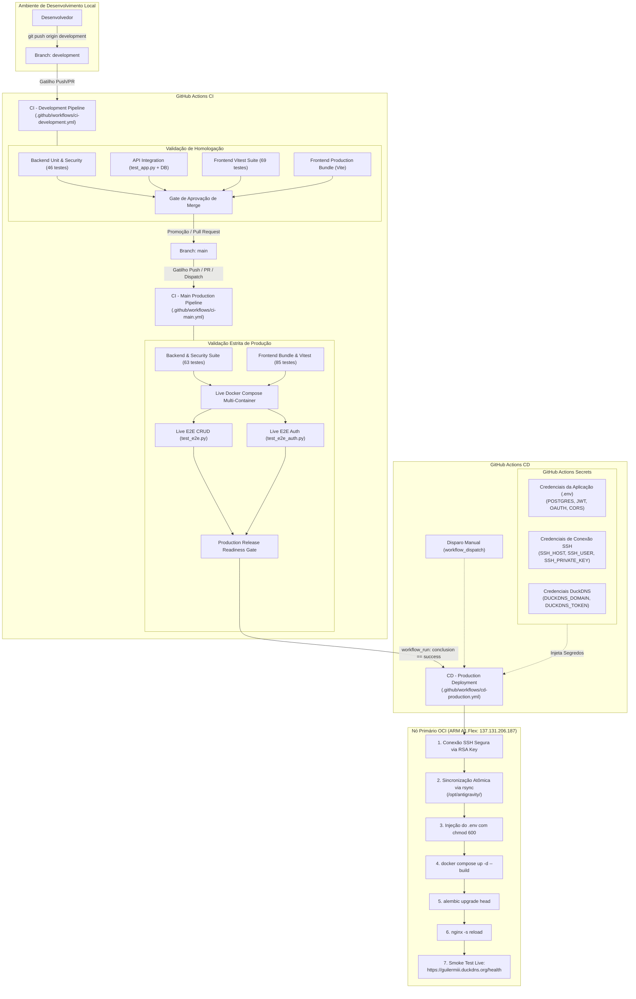

# Ecossistema Monorepo: Portfólio DevOps & Aplicação Fullstack OAuth2

Solução completa estruturada em **Monorepo** profissional, composta por uma **Landing Page SPA de Portfólio DevOps** (`apps/portfolio`), uma **Aplicação Corporativa de Gestão de Usuários com OAuth2** (`apps/crud-frontend`), uma **API REST FastAPI com Alembic e PostgreSQL 16** (`apps/backend`), e **Infraestrutura como Código mantida na raiz (`terraform/`)** provisionando um cluster de 4 instâncias Always-Free na Oracle Cloud Infrastructure (OCI).

Toda a arquitetura é blindada contra **SQL Injection**, **Script Injection (XSS)**, **CSRF / State Tampering** e **Ataques contra JWT**, desenvolvida sob estrita metodologia **TDD** com **167 testes automatizados aprovados (100%)**.

---

## 🛠️ Tecnologias Utilizadas no Monorepo

- **Landing Page de Portfólio DevOps (`apps/portfolio/`)**:
  - **React 18 + Vite 5**: SPA rápida, acessível e responsiva.
  - **Modo Escuro & Modo Claro**: Design tokens em CSS puro com alternância suave e persistência no `localStorage`.
  - **Terminal DevOps & Showcase Cloud**: Componentes interativos demonstrando IaC, pipelines e topologia em tempo real.
  - **Vitest & React Testing Library**: 19 testes unitários e de componentes aprovados.
- **Aplicação CRUD & Autenticação OAuth2 (`apps/crud-frontend/`)**:
  - **React 18 + Vite 5**: SPA de gestão de usuários com Auth Wall obrigatória.
  - **OAuth 2.0 Federado**: Login com GitHub e Google, gestão de sessão JWT e interceptação de erros via hash fragment.
  - **Vitest & React Testing Library**: 85 testes de componentes, responsividade e integração de UI aprovados.
- **Backend API REST (`apps/backend/`)**:
  - **Python 3.11 & FastAPI**: Framework assíncrono de alto rendimento com documentação OpenAPI 3.1 / Swagger.
  - **SQLAlchemy 2.0 & PostgreSQL 16**: ORM moderno com Prepared Statements anti-SQLi e restrições nativas CHECK Constraints.
  - **Alembic**: Migrações versionadas do banco de dados.
  - **Prometheus Client & OpenMetrics**: Instrumentação completa de observabilidade e telemetria.
  - **Python unittest**: 63 testes unitários de schemas, validadores, segurança e probes.
- **DevOps, Nuvem & Infraestrutura**:
  - **Nginx (v1.27)**: Proxy Reverso unificado nas portas `80` e `443` com terminação SSL, roteamento transparente da raiz (`/`) para o Portfólio e `/crud/` para o CRUD, e proteção por headers de segurança (HSTS).
  - **Certbot (Let's Encrypt)**: Automação de certificados SSL/TLS com desafio HTTP-01 e renovação automática.
  - **DuckDNS**: Integração de subdomínio dinâmico público (`guilermiii.duckdns.org`).
  - **Terraform (OCI Always Free - Cluster de 4 Nós)**: Módulo modular de IaC na raiz (`terraform/`) alocando 4 instâncias computacionais, redes VCN e subnets.
  - **GitHub Actions CI/CD**: Esteiras automatizadas de integração e deploy contínuo (`ci-main.yml`, `ci-development.yml`, `cd-production.yml`).
  - **Docker & Docker Compose**: Orquestração integrada de PostgreSQL, FastAPI, Portfólio, CRUD, Prometheus, Nginx e Certbot.

---

## 🏛️ Diagrama de Arquitetura da Solução Monorepo

```mermaid
flowchart TD
    subgraph Client ["Cliente / Navegador / Internet"]
        User(["Visitante / Usuário"])
        DuckDNS["DuckDNS DNS Resolver\n(guilermiii.duckdns.org)"]
        LetsEncrypt["Let's Encrypt ACME CA"]
    end

    subgraph OCI ["Oracle Cloud Infrastructure (Always Free - 4 Instâncias OCI)"]
        subgraph VCN ["VCN: 10.0.0.0/16 | Subnet Pública: 10.0.1.0/24"]
            IGW["Internet Gateway + Default Route Table"]
            SL["Security List / NSG\n(Ingress: 22, 80, 443, ICMP + VCN Interna | Egress: All)"]
            
            subgraph Node1 ["Nó 1: Primário (ARM A1.Flex - 1 OCPU / 6 GB / 47 GB)"]
                ReservedIP["IP Público Reservado (Fixo)\n(Capturado via Bloco Data)"]
                HostFirewall["Firewall iptables (Portas 22, 80, 443)"]
                DuckDNSCron["Cron Job DuckDNS (A cada 5 min)"]

                subgraph DockerEngine1 ["Docker Engine & Docker Compose"]
                    NginxProxy["nginx_proxy (:80, :443)\nProxy Reverso & SSL Termination"]
                    Certbot["certbot_service\n(ACME HTTP-01 Challenge)"]
                    PortfolioApp["portfolio_landing (:3001 interno)\nLanding Page SPA"]
                    ReactApp["react_frontend (:3000 interno)\nCRUD Frontend SPA"]
                    FastAPI["fastapi_app (:8000 interno)\nFastAPI REST API"]
                    Postgres["postgres_db (:5432 interno)\nPostgreSQL 16"]
                    Prometheus["prometheus_service (:9090 interno)"]
                end
            end

            subgraph Node2 ["Nós 2, 3 e 4: Workers Always-Free"]
                Workers["3x Instâncias de Computação OCI para escalabilidade"]
            end
        end

        subgraph OCIStorage ["OCI Storage / Remote State"]
            TFBucket[("Bucket OCI: terraform-states\nPAR HTTP Read/Write")]
        end
    end

    User -->|1. Consulta DNS| DuckDNS
    DuckDNS -->|Retorna IP Fixo Reservado| User
    User -->|2. Requisição HTTPS (443) / HTTP (80)| ReservedIP
    ReservedIP --> IGW
    IGW --> SL
    SL --> HostFirewall
    HostFirewall --> NginxProxy

    NginxProxy -->|location /| PortfolioApp
    NginxProxy -->|location /crud/| ReactApp
    NginxProxy -->|location /users, /auth, /health, /docs| FastAPI
    NginxProxy -->|location /.well-known/acme-challenge/| Certbot
    LetsEncrypt -->|Validação ACME HTTP-01| NginxProxy
    FastAPI --> Postgres
    Prometheus -->|Scrape /metrics| FastAPI

    TerraformCLI["Terraform CLI (raiz /terraform)"] -.->|backend 'http'| TFBucket
```

---

## 📁 Estrutura do Monorepo

```text
.
├── terraform/                # [NA RAIZ] Infraestrutura como Código na OCI Always Free
├── docs/                     # [CENTRALIZADO] Documentações de arquitetura
│   ├── contexto-geral.md     # Contexto completo da arquitetura monorepo
│   └── contexto-landing-page.md # Contexto e especificações da Landing Page
├── apps/                     # [APLICAÇÕES DO MONOREPO]
│   ├── portfolio/            # Landing Page SPA DevOps (React 18 + Vite, Dark/Light, Vitest)
│   ├── crud-frontend/        # Aplicação CRUD de Usuários & Auth Wall (React 18 + Vite, Vitest)
│   └── backend/              # API FastAPI, SQLAlchemy, Alembic, Testes unitários/segurança
├── nginx/                    # Reverse Proxy Nginx e Virtual Hosts
├── prometheus/               # Servidor de Métricas Prometheus
├── certbot/                  # Certificados e renovação SSL Let's Encrypt
├── scripts/                  # Scripts DevOps (sync de segredos e init letsencrypt)
├── .github/                  # Pipelines de CI/CD (development, main, production)
├── docker-compose.yml        # Orquestrador de todos os containers
├── package.json              # NPM Workspaces para scripts a partir da raiz
├── README.md                 # Guia geral de uso e documentação
├── .env.example
├── .gitignore
└── .dockerignore
```


---

## 🚀 Como Executar Localmente com Nginx Proxy Reverso

### 1. Iniciar os serviços com Docker Compose

```bash
docker compose up -d --build
```

Os serviços serão iniciados e o Nginx centralizará o acesso nas portas `80` (HTTP) e `443` (HTTPS):
- **Landing Page SPA (Portfólio DevOps)**: [http://localhost](http://localhost) (ou direto em [http://localhost:3001](http://localhost:3001))
- **Aplicação Web (CRUD Usuários & OAuth2)**: [http://localhost/crud](http://localhost/crud) (ou direto em [http://localhost:3000](http://localhost:3000))
- **API FastAPI (Documentação Swagger)**: [http://localhost/docs](http://localhost/docs)
- **Health Check da API & Banco**: [http://localhost/health](http://localhost/health)
- **Métricas OpenMetrics (Prometheus)**: [http://localhost/metrics](http://localhost/metrics)
- **Painel Prometheus**: [http://localhost:9090](http://localhost:9090) (interno/debug)

### Comandos Úteis via NPM Workspaces (Raiz do Monorepo):
```bash
# Iniciar a Landing Page de Portfólio (porta 3001):
npm run dev:portfolio

# Iniciar a Aplicação de Gestão de Usuários (porta 3000):
npm run dev:crud

# Executar os testes automatizados dos frontends:
npm run test:portfolio   # 19 testes da Landing Page
npm run test:crud        # 85 testes do CRUD Frontend
npm test                 # Executa ambos os frontends

# Executar testes do backend FastAPI:
cd apps/backend && ../../.venv/bin/python3 -m unittest discover -s tests # 63 testes
```

---

## 📌 Rotas da API

| Método | Rota | Descrição |
|---|---|---|
| `GET` | `/` | Status da API e link para a documentação interativa |
| `GET` | `/health` | Health check ativo com probe de conectividade no banco PostgreSQL (`SELECT 1`) |
| `GET` | `/metrics` | Exposição de métricas no padrão OpenMetrics para coleta pelo Prometheus |
| `POST` | `/users/` | Cadastra um novo usuário (validações Pydantic + PostgreSQL) |
| `GET` | `/users/` | Lista usuários cadastrados (com paginação `skip` e `limit`) |
| `GET` | `/users/{id}` | Consulta detalhes e ficha completa de um usuário por ID |
| `PUT` | `/users/{id}` | Atualiza campos de um usuário (parcial ou total) |
| `DELETE` | `/users/{id}` | Remove um usuário por ID |


---

## 🧪 Exemplos de Requisições via cURL

### Criar Usuário (Apenas Campos Obrigatórios):
```bash
curl -X POST "http://localhost:8000/users/" \
     -H "Content-Type: application/json" \
     -d '{
       "nome": "Guilherme",
       "sobrenome": "Morais",
       "email": "guilherme@example.com"
     }'
```

### Criar Usuário Completo:
```bash
curl -X POST "http://localhost:8000/users/" \
     -H "Content-Type: application/json" \
     -d '{
       "nome": "Fernanda",
       "sobrenome": "Montenegro",
       "email": "fernanda@example.com",
       "telefone": "(11) 98765-4321",
       "idade": 45,
       "genero": "Feminino",
       "cpf": "52998224725",
       "rua": "Av Paulista",
       "numero": "1578",
       "cidade": "São Paulo",
       "estado": "SP",
       "cep": "01310-200",
       "pais": "Brasil",
       "escolaridade": "Pós-Graduação"
     }'
```

### Atualizar Usuário:
```bash
curl -X PUT "http://localhost:8000/users/1" \
     -H "Content-Type: application/json" \
     -d '{
       "sobrenome": "Morais Silva",
       "telefone": "(11) 99999-8888",
       "cidade": "Campinas"
     }'
```

### Listar Usuários:
```bash
curl -X GET "http://localhost:8000/users/"
```

### Deletar Usuário:
```bash
curl -X DELETE "http://localhost:8000/users/1"
```

---

## 📊 Observabilidade e Monitoramento com Prometheus

A aplicação conta com instrumentação de ponta a ponta para monitoramento em tempo real através do **Prometheus** e métricas expostas no padrão **OpenMetrics**:

### 🎯 Principais Métricas Coletadas

| Métrica | Tipo | Labels | Descrição |
|---|---|---|---|
| `http_requests_total` | Counter | `method`, `endpoint`, `status_code` | Total acumulado de requisições HTTP processadas |
| `http_request_duration_seconds` | Histogram | `method`, `endpoint` | Distribuição da latência das requisições em segundos (buckets de 5ms a 10s) |
| `http_requests_in_progress` | Gauge | `method` | Conexões e requisições concorrentes ativas em tempo real |
| `app_users_total` | Gauge | - | Total de usuários cadastrados no PostgreSQL |
| `app_user_operations_total` | Counter | `operation`, `status` | Contagem de operações de CRUD (`create`, `update`, `delete`) |
| `app_oauth_logins_total` | Counter | `provider`, `status` | Tentativas e desfechos de autenticação OAuth2 (`github`, `google`) |

### 🛡️ Prevenção de Alta Cardinalidade (Anti-Cardinality Explosion)
O middleware do backend normaliza automaticamente rotas parametrizadas (por exemplo, transformando chamadas a `/users/42` ou `/users/105` no template `/users/{user_id}`). Rotas inexistentes são agrupadas como `not_found`, garantindo estabilidade e memória constante no Prometheus.

### 📈 Exemplos de Consultas PromQL
No painel do Prometheus ([http://localhost:9090](http://localhost:9090)):
- **Taxa de requisições por segundo**: `rate(http_requests_total[1m])`
- **Percentil 95 de latência da API**: `histogram_quantile(0.95, sum(rate(http_request_duration_seconds_bucket[1m])) by (le, endpoint))`
- **Taxa de erros (status 4xx / 5xx)**: `sum(rate(http_requests_total{status_code=~"[45].."}[1m]))`
- **Total de usuários no sistema**: `app_users_total`

---

## 🔐 Sincronização de Credenciais no GitHub Secrets

Para garantir que o repositório permaneça 100% seguro (com `.env`, `*.tfvars` e `*duckdns.txt` devidamente ignorados pelo `.gitignore`), criamos um script de sincronização automatizada que lê as variáveis de ambiente locais e cadastra diretamente nos **GitHub Actions Secrets**:

```bash
./scripts/sync-github-secrets.sh
```

### O que o script realiza:
1. Valida a autenticação no **GitHub CLI (`gh`)**.
2. Lê todas as credenciais do arquivo `.env` local (`POSTGRES_*`, `JWT_*`, `GITHUB_*`, `GOOGLE_*`, `FRONTEND_URL`, etc.).
3. Lê os dados de domínio e token do DuckDNS.
4. Cadastra/atualiza cada segredo no repositório GitHub via `gh secret set <NOME> --body <VALOR>` com status individual.

---

## 🧪 Como Executar os Testes (Metodologia TDD)
 
 Com os containers em execução (`docker compose up -d`), execute todas as camadas da pirâmide de testes:
 
### 1. Testes Unitários e de Segurança do Backend (Python unittest)
Valida regras de negócio puras, validadores de CPF/CEP, observabilidade Prometheus, fluxos OAuth2, JWT e **blindagem contra SQLi, XSS, CSRF e Alg: None** (54 testes):
```bash
docker compose exec app python -m unittest discover -s tests
```

Para executar especificamente a suíte de métricas e observabilidade:
```bash
docker compose exec app python -m unittest tests/test_metrics.py
```


### 2. Testes do Frontend (Vitest + React Testing Library)
Executa 68 testes cobrindo formatadores, botões OAuth2, perfil da Navbar, responsividade mobile/tablet, componentes, máscaras, modais e fluxo integrado da UI:
```bash
docker compose exec frontend npm test
```

### 3. Testes de Integração da API Backend (FastAPI + PostgreSQL)
Valida todas as rotas HTTP, status codes (`200`, `201`, `400`, `404`, `422`, `204`) e persistência no banco:
```bash
docker compose exec app python test_app.py
```

### 4. Testes Ponta a Ponta (E2E)
Validação completa do sistema ao vivo (Frontend, Backend, PostgreSQL e Autenticação):
```bash
python3 test_e2e.py
python3 test_e2e_auth.py
```

---

## 🔄 Estratégia de Branches, CI & Continuous Deployment (CD)

O repositório adota uma estratégia de ramificação com esteiras de integração contínua (CI) e entrega contínua (CD) dedicadas e automatizadas via **GitHub Actions**:



### 🌿 Diferenças entre as Branches

| Característica | `development` (Homologação & Dev) | `main` (Produção) |
|---|---|---|
| **Propósito** | Desenvolvimento contínuo, novas features e validação inicial | Código estável, homologado e pronto para produção |
| **Versão da API** | `2.2.0-dev` | `2.1.0` |
| **Título da API** | `... [DEVELOPMENT]` | `API de Cadastro de Usuários & Autenticação OAuth2` |
| **Endpoint Raiz (`/`)** | `"environment": "development"`, `"debug": true` | `"environment": "production"` |
| **Interface Visual** | Badge de ambiente no topo da Navbar: `Ambiente: DEV` | Interface limpa e definitiva de produção sem marcadores de dev |
| **Esteira de CI** | `.github/workflows/ci-development.yml` | `.github/workflows/ci-main.yml` |
| **Esteira de CD** | N/A | `.github/workflows/cd-production.yml` (disparo automático) |
| **Gating de Promoção** | Passing na CI de dev gera sumário de aprovação para merge na `main` | Execução completa com stack Docker Compose ao vivo e testes E2E |

---

## 🔐 Catálogo de Credenciais (GitHub Secrets)

Para permitir a operação 100% autônoma das esteiras de CI/CD sem expor nenhuma informação sensível no Git, o projeto utiliza 26 segredos gerenciados no **GitHub Secrets**:

| Categoria | Nome do Secret | Origem / Padrão | Finalidade |
|---|---|---|---|
| **Deploy SSH** | `SSH_HOST` | `137.131.206.187` | Endereço IP fixo reservado do nó primário OCI |
| **Deploy SSH** | `SSH_USER` | `ubuntu` | Usuário de autenticação remota na máquina |
| **Deploy SSH** | `SSH_PORT` | `22` | Porta do serviço OpenSSH |
| **Deploy SSH** | `SSH_PRIVATE_KEY` | `~/.ssh/id_rsa` | Chave privada RSA autorizada na OCI |
| **DuckDNS** | `DUCKDNS_DOMAIN` | `guilermiii` | Subdomínio público no DuckDNS |
| **DuckDNS** | `DUCKDNS_TOKEN` | `terraform/duckdns.txt` | Token de atualização de IP dinâmico |
| **Aplicação** | `ENVIRONMENT` | `.env` (`production`) | Modo de execução da aplicação |
| **Aplicação** | `DEBUG` | `.env` (`false`) | Desativação de stacktraces na API |
| **Aplicação** | `APP_VERSION` | `.env` (`2.2.0`) | Versão semântica da aplicação |
| **Banco de Dados** | `POSTGRES_USER` | `.env` (`postgres`) | Usuário do banco de dados |
| **Banco de Dados** | `POSTGRES_PASSWORD` | `.env` | Senha de autenticação do PostgreSQL |
| **Banco de Dados** | `POSTGRES_DB` | `.env` (`users_db`) | Nome do banco relacional |
| **Banco de Dados** | `POSTGRES_HOST` | `.env` (`db`) | Host interno do serviço Docker |
| **Banco de Dados** | `POSTGRES_PORT` | `.env` (`5432`) | Porta interna do PostgreSQL |
| **Banco de Dados** | `DATABASE_URL` | `.env` | URI de conexão SQLAlchemy |
| **Segurança JWT** | `JWT_SECRET_KEY` | `.env` | Chave de 64 caracteres para assinatura HMAC-SHA256 |
| **Segurança JWT** | `JWT_ALGORITHM` | `.env` (`HS256`) | Algoritmo de assinatura de sessão |
| **Segurança JWT** | `ACCESS_TOKEN_EXPIRE_MINUTES` | `.env` (`1440`) | Duração da sessão autenticada (minutos) |
| **Frontend & CORS** | `FRONTEND_URL` | `.env` (`https://guilermiii.duckdns.org`) | Origem confiável para CORS e redirects |
| **Frontend & CORS** | `VITE_API_URL` | `.env` (`https://guilermiii.duckdns.org`) | Endereço da API consumido pelo SPA |
| **OAuth 2.0** | `GITHUB_CLIENT_ID` | `.env` | Client ID registrado no GitHub OAuth App |
| **OAuth 2.0** | `GITHUB_CLIENT_SECRET` | `.env` | Client Secret do GitHub OAuth App |
| **OAuth 2.0** | `GITHUB_REDIRECT_URI` | `.env` (`.../auth/github/callback`) | Callback URI registrado no GitHub |
| **OAuth 2.0** | `GOOGLE_CLIENT_ID` | `.env` | Client ID registrado no Google Cloud Console |
| **OAuth 2.0** | `GOOGLE_CLIENT_SECRET` | `.env` | Client Secret do Google Cloud Console |
| **OAuth 2.0** | `GOOGLE_REDIRECT_URI` | `.env` (`.../auth/google/callback`) | Callback URI registrado no Google Cloud |

### 🚀 Sincronização Automatizada de Segredos

O repositório inclui o script utilitário [`scripts/sync-github-secrets.sh`](file:///home/guilermiii/github/antigravity/scripts/sync-github-secrets.sh):

```bash
# 1. Auditar segredos locais sem enviar nada:
./scripts/sync-github-secrets.sh --audit

# 2. Autenticar no GitHub CLI:
gh auth login

# 3. Sincronizar todos os 26 segredos com o repositório:
./scripts/sync-github-secrets.sh
```

---

## 🛑 Como Parar os Containers

```bash
docker compose down
```

Para parar e remover os volumes persistentes do banco de dados:
```bash
docker compose down -v
```
