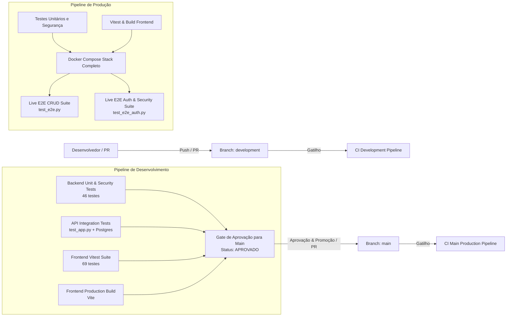

# Sistema de Cadastro de Usuários & Autenticação OAuth2 (FastAPI + PostgreSQL + React + Docker)

Aplicação web completa com operações de CRUD de usuários e **autenticação federada OAuth 2.0 (GitHub e Google/Gmail)** com tokens JWT, persistência relacional em PostgreSQL com **validações nativas via CHECK Constraints**, migrações versionadas com **Alembic**, frontend limpo e responsivo em **React 18 + Vite**, arquitetura blindada contra **SQL Injection**, **Script Injection (XSS)**, **CSRF / State Tampering** e **Ataques JWT (Alg: None)**, desenvolvida sob metodologia **TDD**.

---

## 🛠️ Tecnologias Utilizadas

- **Backend**:
  - **Python 3.11**
  - **FastAPI**: Framework web assíncrono de alta performance com OpenAPI 3.1 / Swagger integrada.
  - **OAuth 2.0 & JWT (PyJWT)**: Autenticação federada com GitHub e Google, geração e validação de tokens JWT (HS256) e State anti-CSRF com HMAC-SHA256.
  - **httpx**: Cliente HTTP assíncrono para comunicação backchannel segura com APIs de terceiros.
  - **SQLAlchemy 2.0**: ORM moderno com consultas 100% parametrizadas (Prepared Statements anti-SQLi).
  - **Alembic**: Sistema de migrações versionadas e idempotentes do banco de dados.
  - **Pydantic v2**: Validação estrita de tipos, algoritmo de dígitos verificadores do CPF, CEP e telefone.
  - **PostgreSQL 16**: Banco de dados relacional com restrições `CHECK`, `NOT NULL`, `UNIQUE` e tabela relacional `oauth_accounts`.
  - **Prometheus Client & OpenMetrics**: Instrumentação completa de observabilidade, latência por histograma, contadores de throughput e métricas de negócio.
- **Frontend**:
  - **React 18 + Vite 5**: SPA moderna, limpa e responsiva.
  - **Auth Context**: Gerenciamento de sessão JWT, captura de token por fragmento de URL (`#token=...`) e persistência segura.
  - **Lucide React**: Ícones minimalistas.
  - **Design Clean**: Tipografia Inter, botões OAuth2 de GitHub e Google, badges de perfil na Navbar e modal de detalhes.
- **DevOps, Observabilidade & Testes**:
  - **Docker & Docker Compose**: Orquestração integrada de banco PostgreSQL, backend FastAPI, frontend React e servidor Prometheus.
  - **Prometheus Server (v2.51)**: Coletor de métricas nativo com scraping a cada 10s e painel de consulta PromQL.
  - **Vitest & React Testing Library**: Testes unitários, de responsividade e de integração da interface (68 testes).
  - **Python unittest**: Testes unitários de schemas, validadores, OAuth2, segurança e métricas Prometheus (54 testes).
  - **Testes E2E Automatizados**: Dois scripts de ponta a ponta (`test_e2e.py` e `test_e2e_auth.py`) e integração de API (`test_app.py`).


---

## 📋 Estrutura de Campos do Usuário

| Campo | Tipo | Obrigatoriedade | Validações (Backend e PostgreSQL) |
|---|---|---|---|
| `nome` | String (100) | **Obrigatório** | Mínimo 2 caracteres, não vazio, trim automático. |
| `sobrenome` | String (100) | **Obrigatório** | Mínimo 2 caracteres, não vazio, trim automático. |
| `email` | String (150) | **Obrigatório** | Formato de e-mail válido (`EmailStr`), índice `UNIQUE` no banco. |
| `telefone` | String (20) | Opcional | Formato `(XX) XXXXX-XXXX` ou `(XX) XXXX-XXXX` (10 ou 11 dígitos com DDD). |
| `idade` | Integer | Opcional | Entre 0 e 150 anos (`CHECK (idade >= 0 AND idade <= 150)`). |
| `genero` | String (50) | Opcional | Masculino, Feminino, Não-binário, Outro, Prefiro não informar. |
| `cpf` | String (14) | Opcional | Algoritmo oficial de dígitos verificadores (módulo 11), normalizado. |
| `rua` | String (200) | Opcional | Logradouro / Rua. |
| `numero` | String (20) | Opcional | Número residencial. |
| `cidade` | String (100) | Opcional | Cidade de residência. |
| `estado` | String (50) | Opcional | Estado / UF. |
| `cep` | String (20) | Opcional | Padrão brasileiro `00000-000` (8 dígitos). |
| `pais` | String (100) | Opcional | País de residência (padrão: "Brasil"). |
| `escolaridade` | String (100) | Opcional | Grau de formação acadêmica. |

---

## 📁 Estrutura do Projeto

```text
.
├── alembic/              # Migrações versionadas (Alembic)
├── alembic.ini           # Configuração de conexão do Alembic
├── app/                  # Backend FastAPI
│   ├── __init__.py
│   ├── database.py       # Engine e Session do SQLAlchemy
│   ├── metrics.py        # Instrumentação Prometheus, middleware e endpoints /metrics e /health
│   ├── models.py         # Modelo de Usuário e CheckConstraints
│   ├── schemas.py        # Schemas Pydantic v2 com validações
│   ├── validators.py     # Algoritmo de CPF, CEP e Telefone
│   └── main.py           # Endpoints CRUD, middleware e Swagger
├── frontend/             # Frontend React (Vite)
│   ├── src/
│   │   ├── components/   # Navbar, UserTable, UserFormModal, UserDetailModal, Toast
│   │   ├── services/     # api.js (integração HTTP com o backend)
│   │   ├── utils/        # formatters.js (máscaras e iniciais)
│   │   ├── App.jsx       # Componente principal do CRUD
│   │   └── index.css     # Estilos clean e responsivos
│   └── package.json
├── prometheus/           # Configuração do coletor Prometheus
│   └── prometheus.yml    # Scrape job para o backend FastAPI (:8000/metrics)
├── tests/                # Testes unitários do backend
│   ├── test_metrics.py   # Testes dos endpoints Prometheus, anti-cardinalidade e health
│   ├── test_unit.py      # Validadores, CPF e Anti-SQLi
│   ├── test_auth_unit.py # Validadores unitários de Auth
│   ├── test_auth_security.py # Ataques JWT e CSRF
│   └── test_auth_integration.py # Fluxo OAuth com mocks
├── docker-compose.yml    # Orquestração de Postgres, Backend, Frontend e Prometheus
├── Dockerfile            # Containerização do backend FastAPI
├── requirements.txt      # Dependências Python (incluindo prometheus-client)
├── test_app.py           # Testes de integração da API
├── test_e2e.py           # Testes ponta a ponta (E2E)
├── CONTEXTO.md           # Documentação técnica detalhada
└── README.md             # Este guia
```

---

## 🚀 Como Executar com Docker Compose

### 1. Iniciar os serviços

```bash
docker compose up -d --build
```

Os serviços serão iniciados e o Alembic aplicará as migrações automaticamente no PostgreSQL:
- **Frontend React**: [http://localhost:3000](http://localhost:3000)
- **API FastAPI (Swagger)**: [http://localhost:8000/docs](http://localhost:8000/docs)
- **Painel Prometheus**: [http://localhost:9090](http://localhost:9090)
- **Endpoint de Métricas**: [http://localhost:8000/metrics](http://localhost:8000/metrics)
- **Endpoint de Health Check**: [http://localhost:8000/health](http://localhost:8000/health)
- **PostgreSQL**: Porta `5432`

---

## 📌 Rotas da API

| Método | Rota | Descrição |
|---|---|---|
| `GET` | `/` | Status da API e link para a documentação interativa |
| `GET` | `/health` | Health check ativo com probe de conectividade no banco PostgreSQL (`SELECT 1`) |
| `GET` | `/metrics` | Exposição de métricas no padrão OpenMetrics para coleta pelo Prometheus |
| `POST` | `/users/` | Cadastra um novo usuário (validações Pydantic + PostgreSQL) |
| `GET` | `/users/` | Lista usuários cadastrados (com paginação `skip` e `limit`) |
| `GET` | `/users/{id}` | Consulta detalhes e ficha completa de um usuário por ID |
| `PUT` | `/users/{id}` | Atualiza campos de um usuário (parcial ou total) |
| `DELETE` | `/users/{id}` | Remove um usuário por ID |


---

## 🧪 Exemplos de Requisições via cURL

### Criar Usuário (Apenas Campos Obrigatórios):
```bash
curl -X POST "http://localhost:8000/users/" \
     -H "Content-Type: application/json" \
     -d '{
       "nome": "Guilherme",
       "sobrenome": "Morais",
       "email": "guilherme@example.com"
     }'
```

### Criar Usuário Completo:
```bash
curl -X POST "http://localhost:8000/users/" \
     -H "Content-Type: application/json" \
     -d '{
       "nome": "Fernanda",
       "sobrenome": "Montenegro",
       "email": "fernanda@example.com",
       "telefone": "(11) 98765-4321",
       "idade": 45,
       "genero": "Feminino",
       "cpf": "52998224725",
       "rua": "Av Paulista",
       "numero": "1578",
       "cidade": "São Paulo",
       "estado": "SP",
       "cep": "01310-200",
       "pais": "Brasil",
       "escolaridade": "Pós-Graduação"
     }'
```

### Atualizar Usuário:
```bash
curl -X PUT "http://localhost:8000/users/1" \
     -H "Content-Type: application/json" \
     -d '{
       "sobrenome": "Morais Silva",
       "telefone": "(11) 99999-8888",
       "cidade": "Campinas"
     }'
```

### Listar Usuários:
```bash
curl -X GET "http://localhost:8000/users/"
```

### Deletar Usuário:
```bash
curl -X DELETE "http://localhost:8000/users/1"
```

---

## 📊 Observabilidade e Monitoramento com Prometheus

A aplicação conta com instrumentação de ponta a ponta para monitoramento em tempo real através do **Prometheus** e métricas expostas no padrão **OpenMetrics**:

### 🎯 Principais Métricas Coletadas

| Métrica | Tipo | Labels | Descrição |
|---|---|---|---|
| `http_requests_total` | Counter | `method`, `endpoint`, `status_code` | Total acumulado de requisições HTTP processadas |
| `http_request_duration_seconds` | Histogram | `method`, `endpoint` | Distribuição da latência das requisições em segundos (buckets de 5ms a 10s) |
| `http_requests_in_progress` | Gauge | `method` | Conexões e requisições concorrentes ativas em tempo real |
| `app_users_total` | Gauge | - | Total de usuários cadastrados no PostgreSQL |
| `app_user_operations_total` | Counter | `operation`, `status` | Contagem de operações de CRUD (`create`, `update`, `delete`) |
| `app_oauth_logins_total` | Counter | `provider`, `status` | Tentativas e desfechos de autenticação OAuth2 (`github`, `google`) |

### 🛡️ Prevenção de Alta Cardinalidade (Anti-Cardinality Explosion)
O middleware do backend normaliza automaticamente rotas parametrizadas (por exemplo, transformando chamadas a `/users/42` ou `/users/105` no template `/users/{user_id}`). Rotas inexistentes são agrupadas como `not_found`, garantindo estabilidade e memória constante no Prometheus.

### 📈 Exemplos de Consultas PromQL
No painel do Prometheus ([http://localhost:9090](http://localhost:9090)):
- **Taxa de requisições por segundo**: `rate(http_requests_total[1m])`
- **Percentil 95 de latência da API**: `histogram_quantile(0.95, sum(rate(http_request_duration_seconds_bucket[1m])) by (le, endpoint))`
- **Taxa de erros (status 4xx / 5xx)**: `sum(rate(http_requests_total{status_code=~"[45].."}[1m]))`
- **Total de usuários no sistema**: `app_users_total`

---

## 🧪 Como Executar os Testes (Metodologia TDD)
 
 Com os containers em execução (`docker compose up -d`), execute todas as camadas da pirâmide de testes:
 
### 1. Testes Unitários e de Segurança do Backend (Python unittest)
Valida regras de negócio puras, validadores de CPF/CEP, observabilidade Prometheus, fluxos OAuth2, JWT e **blindagem contra SQLi, XSS, CSRF e Alg: None** (54 testes):
```bash
docker compose exec app python -m unittest discover -s tests
```

Para executar especificamente a suíte de métricas e observabilidade:
```bash
docker compose exec app python -m unittest tests/test_metrics.py
```


### 2. Testes do Frontend (Vitest + React Testing Library)
Executa 68 testes cobrindo formatadores, botões OAuth2, perfil da Navbar, responsividade mobile/tablet, componentes, máscaras, modais e fluxo integrado da UI:
```bash
docker compose exec frontend npm test
```

### 3. Testes de Integração da API Backend (FastAPI + PostgreSQL)
Valida todas as rotas HTTP, status codes (`200`, `201`, `400`, `404`, `422`, `204`) e persistência no banco:
```bash
docker compose exec app python test_app.py
```

### 4. Testes Ponta a Ponta (E2E)
Validação completa do sistema ao vivo (Frontend, Backend, PostgreSQL e Autenticação):
```bash
python3 test_e2e.py
python3 test_e2e_auth.py
```

---

## 🔄 Estratégia de Branches & Esteiras de CI (GitHub Actions)

O repositório adota uma estratégia de ramificação com esteiras de integração contínua (CI) dedicadas e independentes:



### 🌿 Diferenças entre as Branches

| Característica | `development` (Homologação & Dev) | `main` (Produção) |
|---|---|---|
| **Propósito** | Desenvolvimento contínuo, novas features e validação inicial | Código estável, homologado e pronto para produção |
| **Versão da API** | `2.2.0-dev` | `2.1.0` |
| **Título da API** | `... [DEVELOPMENT]` | `API de Cadastro de Usuários & Autenticação OAuth2` |
| **Endpoint Raiz (`/`)** | `"environment": "development"`, `"debug": true` | `"environment": "production"` |
| **Interface Visual** | Badge de ambiente no topo da Navbar: `Ambiente: DEV` | Interface limpa e definitiva de produção sem marcadores de dev |
| **Esteira de CI** | `.github/workflows/ci-development.yml` | `.github/workflows/ci-main.yml` |
| **Gating de Promoção** | Passing na CI de dev gera sumário de aprovação para merge na `main` | Execução completa com stack Docker Compose ao vivo e testes E2E |

---

## 🛑 Como Parar os Containers

```bash
docker compose down
```

Para parar e remover os volumes persistentes do banco de dados:
```bash
docker compose down -v
```
