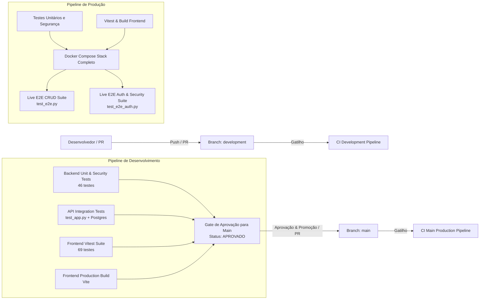

# Sistema de Cadastro de Usuários & Autenticação OAuth2 (FastAPI + PostgreSQL + React + Docker)

Aplicação web completa com operações de CRUD de usuários e **autenticação federada OAuth 2.0 (GitHub e Google/Gmail)** com tokens JWT, persistência relacional em PostgreSQL com **validações nativas via CHECK Constraints**, migrações versionadas com **Alembic**, frontend limpo e responsivo em **React 18 + Vite**, arquitetura blindada contra **SQL Injection**, **Script Injection (XSS)**, **CSRF / State Tampering** e **Ataques JWT (Alg: None)**, desenvolvida sob metodologia **TDD**.

---

## 🛠️ Tecnologias Utilizadas

- **Backend**:
  - **Python 3.11**
  - **FastAPI**: Framework web assíncrono de alta performance com OpenAPI 3.1 / Swagger integrada.
  - **OAuth 2.0 & JWT (PyJWT)**: Autenticação federada com GitHub e Google, geração e validação de tokens JWT (HS256) e State anti-CSRF com HMAC-SHA256.
  - **httpx**: Cliente HTTP assíncrono para comunicação backchannel segura com APIs de terceiros.
  - **SQLAlchemy 2.0**: ORM moderno com consultas 100% parametrizadas (Prepared Statements anti-SQLi).
  - **Alembic**: Sistema de migrações versionadas e idempotentes do banco de dados.
  - **Pydantic v2**: Validação estrita de tipos, algoritmo de dígitos verificadores do CPF, CEP e telefone.
  - **PostgreSQL 16**: Banco de dados relacional com restrições `CHECK`, `NOT NULL`, `UNIQUE` e tabela relacional `oauth_accounts`.
  - **Prometheus Client & OpenMetrics**: Instrumentação completa de observabilidade, latência por histograma, contadores de throughput e métricas de negócio.
- **Frontend**:
  - **React 18 + Vite 5**: SPA moderna, limpa e responsiva.
  - **Auth Context**: Gerenciamento de sessão JWT, captura de token por fragmento de URL (`#token=...`) e persistência segura.
  - **Lucide React**: Ícones minimalistas.
  - **Design Clean**: Tipografia Inter, botões OAuth2 de GitHub e Google, badges de perfil na Navbar e modal de detalhes.
- **DevOps, Nuvem & Infraestrutura**:
  - **Nginx (v1.27)**: Proxy Reverso unificado nas portas `80` e `443` com terminação SSL, roteamento transparente de SPA e API, e proteção por headers de segurança (HSTS).
  - **Certbot (Let's Encrypt)**: Automação de certificados SSL/TLS com desafio HTTP-01 e script de bootstrap contra falha de inicialização (`scripts/init-letsencrypt.sh`).
  - **DuckDNS**: Integração de subdomínio dinâmico (`guilermiii.duckdns.org`).
  - **Terraform (OCI Always Free - Cluster de 4 Nós: 2 ARM A1.Flex + 2 AMD Micro)**: Módulo modular de IaC na Oracle Cloud alocando a cota máxima gratuita com IP público reservado via bloco `data`, discos de boot de 47 GB (188 GB / 200 GB Always Free) e State Locking via HTTP PAR.
  - **GitHub Secrets Sync**: Script de sincronização automática de variáveis locais (`.env` e DuckDNS) para os Secrets do GitHub Actions (`scripts/sync-github-secrets.sh`).
  - **Docker & Docker Compose**: Orquestração integrada de banco PostgreSQL, backend FastAPI, frontend React, coletor Prometheus, Nginx e Certbot.
  - **Prometheus Server (v2.51)**: Coletor de métricas nativo com scraping a cada 10s e painel de consulta PromQL.
  - **Vitest & React Testing Library**: Testes unitários, de responsividade e de integração da interface (85 testes).
  - **Python unittest**: Testes unitários de schemas, validadores, OAuth2, segurança e métricas Prometheus (63 testes).
  - **Testes E2E Automatizados**: Testes de ponta a ponta (`test_e2e.py` e `test_e2e_auth.py`) e integração de API (`test_app.py`).

---

## 🏛️ Diagrama de Arquitetura da Solução (Cluster 4 Nós Always Free)

```mermaid
flowchart TD
    subgraph Client ["Cliente / Navegador / Internet"]
        User(["Usuário / Navegador"])
        DuckDNS["DuckDNS DNS Resolver\n(guilermiii.duckdns.org)"]
        LetsEncrypt["Let's Encrypt ACME CA"]
    end

    subgraph OCI ["Oracle Cloud Infrastructure (Always Free - 4 Instâncias / 188 GB Boot)"]
        subgraph VCN ["VCN: 10.0.0.0/16 | Subnet Pública: 10.0.1.0/24"]
            IGW["Internet Gateway + Default Route Table"]
            SL["Security List / NSG\n(Ingress: 22, 80, 443, ICMP + VCN Interna | Egress: All)"]
            
            subgraph Node1 ["Nó 1: Primário (ARM A1.Flex - 1 OCPU / 6 GB / 47 GB)"]
                ReservedIP["IP Público Reservado (Fixo)\n(Capturado via Bloco Data)"]
                HostFirewall["Firewall iptables (Portas 22, 80, 443)"]
                DuckDNSCron["Cron Job DuckDNS (A cada 5 min)"]

                subgraph DockerEngine1 ["Docker Engine & Docker Compose"]
                    NginxProxy["nginx_proxy (:80, :443)\nProxy Reverso & SSL Termination"]
                    Certbot["certbot_service\n(ACME HTTP-01 Challenge)"]
                    FastAPI["fastapi_app (:8000 interno)"]
                    ReactApp["react_frontend (:3000 interno)"]
                    Postgres["postgres_db (:5432 interno)"]
                    Prometheus["prometheus_service (:9090 interno)"]
                end
            end

            subgraph Node2 ["Nó 2: Worker ARM (ARM A1.Flex - 1 OCPU / 6 GB / 47 GB)"]
                PublicIP2["IP Público Efêmero 2 (SSH :22)"]
                Docker2["Docker Engine Pré-instalado"]
            end

            subgraph Node3 ["Nó 3: Micro AMD 1 (AMD E2.1.Micro - 1/8 OCPU / 1 GB / 47 GB)"]
                PublicIP3["IP Público Efêmero 3 (SSH :22)"]
                Docker3["Docker Engine Pré-instalado"]
            end

            subgraph Node4 ["Nó 4: Micro AMD 2 (AMD E2.1.Micro - 1/8 OCPU / 1 GB / 47 GB)"]
                PublicIP4["IP Público Efêmero 4 (SSH :22)"]
                Docker4["Docker Engine Pré-instalado"]
            end
        end

        subgraph OCIStorage ["OCI Storage / Remote State"]
            TFBucket[("Bucket OCI: terraform-states\nPAR HTTP Read/Write")]
        end
    end

    User -->|1. Consulta DNS| DuckDNS
    DuckDNS -->|Retorna IP Fixo Reservado| User
    User -->|2. Requisição HTTPS (443) / HTTP (80)| ReservedIP
    ReservedIP --> IGW
    IGW --> SL
    SL --> HostFirewall
    HostFirewall --> NginxProxy

    NginxProxy -->|location /| ReactApp
    NginxProxy -->|location /users, /auth, /health, /docs| FastAPI
    NginxProxy -->|location /.well-known/acme-challenge/| Certbot
    LetsEncrypt -->|Validação ACME HTTP-01| NginxProxy
    FastAPI --> Postgres
    Prometheus -->|Scrape /metrics| FastAPI

    TerraformCLI["Terraform CLI"] -.->|backend 'http' (PUT/GET)| TFBucket
```

---

## 📁 Estrutura do Projeto

```text
.
├── alembic/                  # Migrações versionadas de banco (Alembic)
├── alembic.ini               # Configuração de conexão do Alembic
├── app/                      # Backend FastAPI (Auth, Users, Metrics, Database)
├── certbot/                  # Configurações e certificados SSL gerados pelo Certbot
├── frontend/                 # Frontend React 18 + Vite (SPA com Auth Guard e Modais)
├── nginx/                    # Configurações do Proxy Reverso Nginx
│   ├── nginx.conf            # Configuração principal do Nginx
│   └── conf.d/default.conf   # Virtual hosts HTTP (80) e HTTPS (443)
├── prometheus/               # Coletor de métricas Prometheus
├── scripts/
│   └── init-letsencrypt.sh   # Script de bootstrap SSL Let's Encrypt para DuckDNS
├── terraform/                # Manifestos modulares OCI Always Free ARM (IaC)
│   ├── backend.tf            # Backend nativo OCI via HTTP PAR
│   ├── providers.tf          # Provedor oracle/oci
│   ├── variables.tf          # Variáveis parametrizadas
│   ├── terraform.tfvars.example # Modelo de variáveis
│   ├── datasources.tf        # Data block do IP público reservado e lookup de imagem
│   ├── network.tf            # VCN, Internet Gateway, Security List e Subnet
│   ├── compute.tf            # Instância Compute A1.Flex ARM com Ubuntu
│   ├── public_ip.tf          # IP Público Reservado estático
│   ├── outputs.tf            # Outputs com IP fixo, SSH e URLs
│   ├── scripts/cloud-init.yaml # Script cloud-init para Ubuntu ARM
│   └── README.md             # Guia completo de provisionamento OCI
├── tests/                    # Testes unitários do backend (63 testes)
├── docker-compose.yml        # Orquestração com Nginx, Certbot, Postgres, App, Frontend e Prometheus
├── Dockerfile                # Containerização do backend FastAPI
├── requirements.txt          # Dependências Python
├── test_app.py               # Testes de integração de API
├── test_e2e.py               # Teste E2E geral
├── test_e2e_auth.py          # Testes E2E de segurança e autenticação OAuth2
├── CONTEXTO.md               # Documentação técnica detalhada de arquitetura
└── README.md                 # Este guia
```

---

## 🚀 Como Executar Localmente com Nginx Proxy Reverso

### 1. Iniciar os serviços com Docker Compose

```bash
docker compose up -d --build
```

Os serviços serão iniciados e o Nginx centralizará o acesso nas portas `80` (HTTP) e `443` (HTTPS):
- **Aplicação Web (React Frontend)**: [http://localhost](http://localhost) ou [https://localhost](https://localhost)
- **API FastAPI (Documentação Swagger)**: [http://localhost/docs](http://localhost/docs)
- **Health Check da API & Banco**: [http://localhost/health](http://localhost/health)
- **Métricas OpenMetrics (Prometheus)**: [http://localhost/metrics](http://localhost/metrics)
- **Painel Prometheus**: [http://localhost:9090](http://localhost:9090) (interno/debug)

---

## 📌 Rotas da API

| Método | Rota | Descrição |
|---|---|---|
| `GET` | `/` | Status da API e link para a documentação interativa |
| `GET` | `/health` | Health check ativo com probe de conectividade no banco PostgreSQL (`SELECT 1`) |
| `GET` | `/metrics` | Exposição de métricas no padrão OpenMetrics para coleta pelo Prometheus |
| `POST` | `/users/` | Cadastra um novo usuário (validações Pydantic + PostgreSQL) |
| `GET` | `/users/` | Lista usuários cadastrados (com paginação `skip` e `limit`) |
| `GET` | `/users/{id}` | Consulta detalhes e ficha completa de um usuário por ID |
| `PUT` | `/users/{id}` | Atualiza campos de um usuário (parcial ou total) |
| `DELETE` | `/users/{id}` | Remove um usuário por ID |


---

## 🧪 Exemplos de Requisições via cURL

### Criar Usuário (Apenas Campos Obrigatórios):
```bash
curl -X POST "http://localhost:8000/users/" \
     -H "Content-Type: application/json" \
     -d '{
       "nome": "Guilherme",
       "sobrenome": "Morais",
       "email": "guilherme@example.com"
     }'
```

### Criar Usuário Completo:
```bash
curl -X POST "http://localhost:8000/users/" \
     -H "Content-Type: application/json" \
     -d '{
       "nome": "Fernanda",
       "sobrenome": "Montenegro",
       "email": "fernanda@example.com",
       "telefone": "(11) 98765-4321",
       "idade": 45,
       "genero": "Feminino",
       "cpf": "52998224725",
       "rua": "Av Paulista",
       "numero": "1578",
       "cidade": "São Paulo",
       "estado": "SP",
       "cep": "01310-200",
       "pais": "Brasil",
       "escolaridade": "Pós-Graduação"
     }'
```

### Atualizar Usuário:
```bash
curl -X PUT "http://localhost:8000/users/1" \
     -H "Content-Type: application/json" \
     -d '{
       "sobrenome": "Morais Silva",
       "telefone": "(11) 99999-8888",
       "cidade": "Campinas"
     }'
```

### Listar Usuários:
```bash
curl -X GET "http://localhost:8000/users/"
```

### Deletar Usuário:
```bash
curl -X DELETE "http://localhost:8000/users/1"
```

---

## 📊 Observabilidade e Monitoramento com Prometheus

A aplicação conta com instrumentação de ponta a ponta para monitoramento em tempo real através do **Prometheus** e métricas expostas no padrão **OpenMetrics**:

### 🎯 Principais Métricas Coletadas

| Métrica | Tipo | Labels | Descrição |
|---|---|---|---|
| `http_requests_total` | Counter | `method`, `endpoint`, `status_code` | Total acumulado de requisições HTTP processadas |
| `http_request_duration_seconds` | Histogram | `method`, `endpoint` | Distribuição da latência das requisições em segundos (buckets de 5ms a 10s) |
| `http_requests_in_progress` | Gauge | `method` | Conexões e requisições concorrentes ativas em tempo real |
| `app_users_total` | Gauge | - | Total de usuários cadastrados no PostgreSQL |
| `app_user_operations_total` | Counter | `operation`, `status` | Contagem de operações de CRUD (`create`, `update`, `delete`) |
| `app_oauth_logins_total` | Counter | `provider`, `status` | Tentativas e desfechos de autenticação OAuth2 (`github`, `google`) |

### 🛡️ Prevenção de Alta Cardinalidade (Anti-Cardinality Explosion)
O middleware do backend normaliza automaticamente rotas parametrizadas (por exemplo, transformando chamadas a `/users/42` ou `/users/105` no template `/users/{user_id}`). Rotas inexistentes são agrupadas como `not_found`, garantindo estabilidade e memória constante no Prometheus.

### 📈 Exemplos de Consultas PromQL
No painel do Prometheus ([http://localhost:9090](http://localhost:9090)):
- **Taxa de requisições por segundo**: `rate(http_requests_total[1m])`
- **Percentil 95 de latência da API**: `histogram_quantile(0.95, sum(rate(http_request_duration_seconds_bucket[1m])) by (le, endpoint))`
- **Taxa de erros (status 4xx / 5xx)**: `sum(rate(http_requests_total{status_code=~"[45].."}[1m]))`
- **Total de usuários no sistema**: `app_users_total`

---

## 🔐 Sincronização de Credenciais no GitHub Secrets

Para garantir que o repositório permaneça 100% seguro (com `.env`, `*.tfvars` e `*duckdns.txt` devidamente ignorados pelo `.gitignore`), criamos um script de sincronização automatizada que lê as variáveis de ambiente locais e cadastra diretamente nos **GitHub Actions Secrets**:

```bash
./scripts/sync-github-secrets.sh
```

### O que o script realiza:
1. Valida a autenticação no **GitHub CLI (`gh`)**.
2. Lê todas as credenciais do arquivo `.env` local (`POSTGRES_*`, `JWT_*`, `GITHUB_*`, `GOOGLE_*`, `FRONTEND_URL`, etc.).
3. Lê os dados de domínio e token do DuckDNS.
4. Cadastra/atualiza cada segredo no repositório GitHub via `gh secret set <NOME> --body <VALOR>` com status individual.

---

## 🧪 Como Executar os Testes (Metodologia TDD)
 
 Com os containers em execução (`docker compose up -d`), execute todas as camadas da pirâmide de testes:
 
### 1. Testes Unitários e de Segurança do Backend (Python unittest)
Valida regras de negócio puras, validadores de CPF/CEP, observabilidade Prometheus, fluxos OAuth2, JWT e **blindagem contra SQLi, XSS, CSRF e Alg: None** (54 testes):
```bash
docker compose exec app python -m unittest discover -s tests
```

Para executar especificamente a suíte de métricas e observabilidade:
```bash
docker compose exec app python -m unittest tests/test_metrics.py
```


### 2. Testes do Frontend (Vitest + React Testing Library)
Executa 68 testes cobrindo formatadores, botões OAuth2, perfil da Navbar, responsividade mobile/tablet, componentes, máscaras, modais e fluxo integrado da UI:
```bash
docker compose exec frontend npm test
```

### 3. Testes de Integração da API Backend (FastAPI + PostgreSQL)
Valida todas as rotas HTTP, status codes (`200`, `201`, `400`, `404`, `422`, `204`) e persistência no banco:
```bash
docker compose exec app python test_app.py
```

### 4. Testes Ponta a Ponta (E2E)
Validação completa do sistema ao vivo (Frontend, Backend, PostgreSQL e Autenticação):
```bash
python3 test_e2e.py
python3 test_e2e_auth.py
```

---

## 🔄 Estratégia de Branches & Esteiras de CI (GitHub Actions)

O repositório adota uma estratégia de ramificação com esteiras de integração contínua (CI) dedicadas e independentes:



### 🌿 Diferenças entre as Branches

| Característica | `development` (Homologação & Dev) | `main` (Produção) |
|---|---|---|
| **Propósito** | Desenvolvimento contínuo, novas features e validação inicial | Código estável, homologado e pronto para produção |
| **Versão da API** | `2.2.0-dev` | `2.1.0` |
| **Título da API** | `... [DEVELOPMENT]` | `API de Cadastro de Usuários & Autenticação OAuth2` |
| **Endpoint Raiz (`/`)** | `"environment": "development"`, `"debug": true` | `"environment": "production"` |
| **Interface Visual** | Badge de ambiente no topo da Navbar: `Ambiente: DEV` | Interface limpa e definitiva de produção sem marcadores de dev |
| **Esteira de CI** | `.github/workflows/ci-development.yml` | `.github/workflows/ci-main.yml` |
| **Gating de Promoção** | Passing na CI de dev gera sumário de aprovação para merge na `main` | Execução completa com stack Docker Compose ao vivo e testes E2E |

---

## 🛑 Como Parar os Containers

```bash
docker compose down
```

Para parar e remover os volumes persistentes do banco de dados:
```bash
docker compose down -v
```
