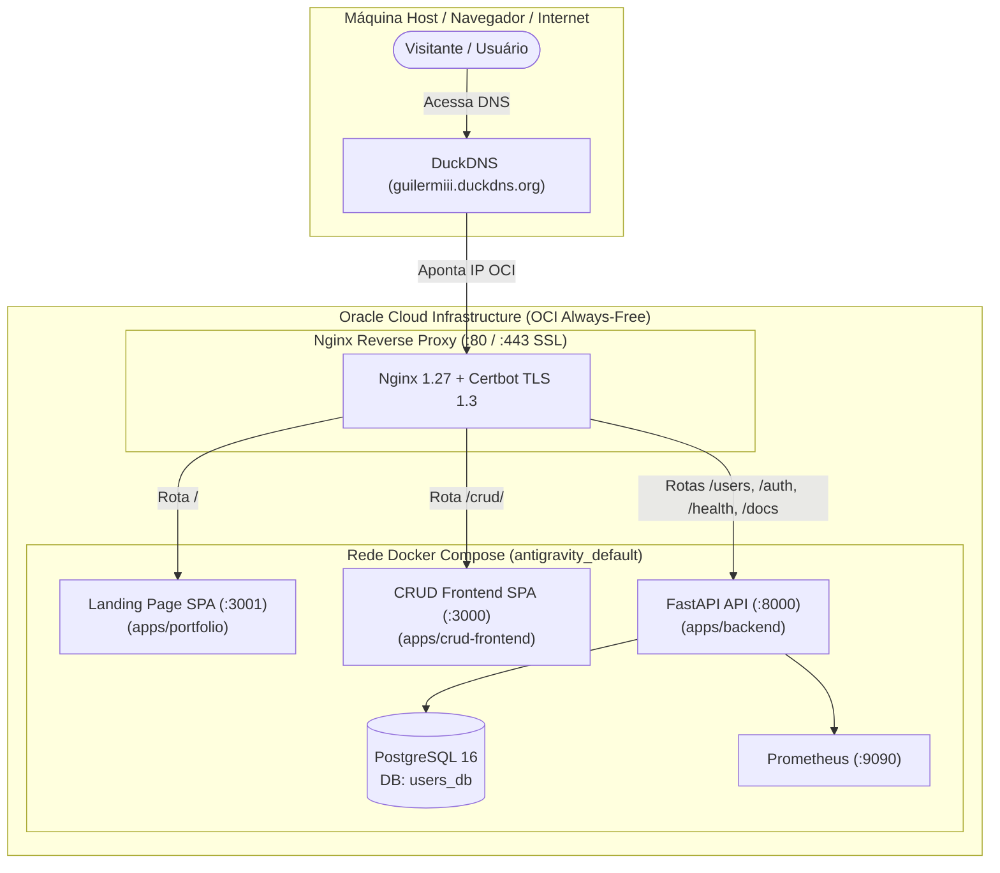

# 📋 Contexto Geral do Projeto: Ecossistema Monorepo & Portfólio DevOps

> **Documento de Contexto e Arquitetura Geral**  
> **Localização:** `docs/contexto-geral.md`  
> **Última atualização:** 14 de Setembro de 2026  
> **Status:** Concluído, reorganizado em arquitetura **Monorepo** com 3 aplicações em `apps/` (`apps/portfolio`, `apps/crud-frontend`, `apps/backend`), infraestrutura Terraform OCI mantida na raiz, testes 100% aprovados com TDD (167 testes automatizados no total) e orquestração unificada via Docker Compose e Nginx.

---

## 1. 🎯 Visão Geral e Objetivo

O repositório **antigravity** é estruturado como um **Monorepo** profissional moderno que abriga todo o ciclo de vida de engenharia de software e plataforma:
1. **Landing Page de Portfólio DevOps (`apps/portfolio/`)**: SPA limpa em React 18 e Vite com suporte nativo a Modo Escuro/Claro, telemetria da arquitetura em nuvem e apresentação das competências técnicas de Guilherme.
2. **Sistema CRUD de Usuários & Auth OAuth2 (`apps/crud-frontend/`)**: Interface corporativa com bloqueio estrito (Auth Wall), autenticação federada com GitHub e Google, filtros em tempo real e formulários com máscaras.
3. **API REST FastAPI & Migrações (`apps/backend/`)**: Serviço backend de alto rendimento em Python 3.11, ORM SQLAlchemy 2.0, migrações versionadas com Alembic, blindagem anti-SQLi/XSS/CSRF e JWT HS256.
4. **Infraestrutura como Código (`terraform/` na raiz)**: Provisionamento de cluster com 4 instâncias Always-Free na Oracle Cloud Infrastructure (OCI), redes virtuais (VCN), subnets e integração com DuckDNS.
5. **Proxy Reverso & Gateway (`nginx/`)**: Roteamento unificado da raiz (`/`) para a Landing Page e `/crud/` para o CRUD de Usuários, com terminação SSL/TLS (Let's Encrypt / Certbot).
6. **Observabilidade (`prometheus/`)**: Monitoramento contínuo de latência, vazão e integridade de containers.

### 🛠️ Stack Tecnológica Consolidada

| Camada | Tecnologia | Descrição / Papel |
|---|---|---|
| **Portfólio Frontend** | React 18 / Vite 5 | SPA moderna de portfólio DevOps em `apps/portfolio`, com Modo Claro/Escuro e 19 testes Vitest. |
| **CRUD Frontend** | React 18 / Vite 5 | SPA de gerenciamento de usuários em `apps/crud-frontend`, com Auth Wall e 85 testes Vitest. |
| **Backend API** | Python 3.11 / FastAPI | Framework REST assíncrono em `apps/backend`, com OpenAPI 3.1 e 63 testes unitários/segurança. |
| **Autenticação** | OAuth 2.0 / PyJWT / httpx | Fluxo de autorização federado com GitHub e Google, emissão de JWT (HS256) e State anti-CSRF com HMAC-SHA256. |
| **ORM / Banco** | SQLAlchemy 2.0 / PostgreSQL 16 | Mapeamento objeto-relacional com consultas 100% parametrizadas, tabela `oauth_accounts` e volume persistente. |
| **Migrações** | Alembic 1.19 | Gerenciamento versionado e automatizado de DDL e restrições de integridade no banco. |
| **Validação Backend**| Pydantic v2 / email-validator | Schemas com validação estrita de dados, algoritmo de CPF, formato de CEP e telefone. |
| **Validação DB** | PostgreSQL CHECK Constraints | Restrições nativas de integridade de dados e validações regex executadas pela engine do banco. |
| **Observabilidade** | Prometheus / prometheus-client | Métricas de vazão (Throughput), histograma de latência, conexões ativas, contadores de CRUD e eventos OAuth2 com OpenMetrics. |
| **Reverse Proxy & TLS**| Nginx 1.27 / Certbot | Gateway unificado com HTTP/2, HSTS e renovação automática de certificados Let's Encrypt. |
| **Infraestrutura (IaC)**| Terraform / OCI Provider | 4 instâncias computacionais Always-Free na Oracle Cloud, redes VCN e integração DuckDNS. |
| **Containerização**| Docker & Docker Compose | Orquestração integrada de banco, backend, 2 frontends, prometheus, nginx e certbot. |
| **Testes Automatizados**| Vitest + Python unittest | **167 testes automatizados aprovados (100%)**: 63 backend, 85 crud frontend e 19 portfolio landing page. |

---

## 2. 🏛️ Arquitetura do Sistema Monorepo



---

## 3. 📂 Estrutura Completa de Diretórios e Arquivos (Monorepo)

```text
/home/guilermiii/github/antigravity/
│
├── terraform/                            # [MANTIDO NA RAIZ] Infraestrutura como Código na OCI Always-Free
│   ├── compute.tf                        # 4 instâncias computacionais (A1 Flex / E2 Micro)
│   ├── network.tf                        # VCN, subnets públicas/privadas, Security Lists
│   ├── datasources.tf                    # Imagens de SO e availability domains
│   ├── providers.tf                      # Provedores OCI
│   ├── variables.tf                      # Variáveis e parametrização de ambiente
│   ├── outputs.tf                        # IPs públicos e URLs exportadas
│   └── README.md                         # Guia detalhado da infraestrutura Terraform
│
├── docs/                                 # [NOVO DIRETÓRIO] Documentações centralizadas
│   ├── contexto-geral.md                 # Este documento de contexto global e arquitetura
│   └── contexto-landing-page.md          # Contexto específico da Landing Page de Portfólio
│
├── apps/                                 # [NOVO DIRETÓRIO] Aplicações do Monorepo
│   ├── portfolio/                        # [NOVA SPA] Landing Page de Portfólio DevOps (React 18 + Vite)
│   │   ├── src/
│   │   │   ├── components/               # Navbar, Hero, Terminal, ArchitectureShowcase, Skills, Projects, etc.
│   │   │   ├── context/                  # ThemeContext (Modo Escuro e Claro com persistência)
│   │   │   ├── data/                     # Dados do portfólio desacoplados
│   │   │   ├── App.jsx                   # Componente central da SPA
│   │   │   ├── index.css                 # Design tokens globais e temas
│   │   │   └── setupTests.js             # Polyfills de localStorage e matchMedia
│   │   ├── Dockerfile                    # Container da Landing Page (:3001)
│   │   ├── package.json                  # Dependências e scripts do portfólio
│   │   └── vite.config.js                # Configuração do Vite e Vitest
│   │
│   ├── crud-frontend/                    # [MOVIDO] Aplicação Frontend de Gestão de Usuários (React 18 + Vite)
│   │   ├── src/
│   │   │   ├── components/               # AuthButtons, LoginScreen, Navbar, UserTable, Modais
│   │   │   ├── context/                  # AuthContext (Gestão de sessão, token JWT e erros)
│   │   │   ├── services/                 # api.js com cliente REST
│   │   │   └── setupTests.js             # Polyfill de localStorage
│   │   ├── Dockerfile                    # Container do CRUD (:3000)
│   │   ├── package.json
│   │   └── vite.config.js
│   │
│   └── backend/                          # [MOVIDO] API REST FastAPI & Migrações
│       ├── app/                          # Código Python (main, models, schemas, auth, metrics, validators)
│       ├── alembic/                      # Migrações versionadas de banco PostgreSQL
│       ├── tests/                        # 63 testes unitários e de segurança
│       ├── alembic.ini                   # Configurações do Alembic
│       ├── Dockerfile                    # Imagem Python 3.11 (:8000)
│       ├── requirements.txt              # Dependências Python
│       ├── test_app.py                   # Testes de integração de API
│       ├── test_e2e.py                   # Testes ponta a ponta E2E
│       └── test_e2e_auth.py              # Testes ponta a ponta E2E de OAuth2
│
├── nginx/                                # Proxy Reverso e Gateway de Produção
│   ├── nginx.conf                        # Configuração principal do Nginx
│   └── conf.d/
│       └── default.conf                  # Roteamento de / para portfolio, /crud/ para crud e API para backend
├── prometheus/                           # Servidor de Métricas Prometheus
│   └── prometheus.yml                    # Scrape contínuo a cada 10s
├── certbot/                              # Armazenamento e renovação de certificados SSL Let's Encrypt
├── scripts/                              # Scripts utilitários de DevOps
│   ├── init-letsencrypt.sh               # Bootstrap inicial de certificados SSL
│   └── sync-github-secrets.sh            # Sincronização automatizada de 26 segredos no GitHub Actions
├── .github/                              # Workflows CI/CD integrados
│   └── workflows/
│       ├── ci-development.yml            # Testes e gates de branch development
│       ├── ci-main.yml                   # Testes, build de produção e Docker Compose E2E na branch main
│       └── cd-production.yml             # Deploy contínuo automatizado na instância OCI
├── docker-compose.yml                    # Orquestrador Docker Compose unificado
├── package.json                          # [NOVO NA RAIZ] NPM Workspaces para scripts globais
├── README.md                             # [MANTIDO NA RAIZ] Documentação principal e instruções de execução
├── .env.example                          # Variáveis de ambiente de exemplo
├── .gitignore                            # Regras de exclusão do Git para Monorepo
└── .dockerignore                         # Regras de exclusão de build Docker
```

---

## 4. ⚙️ Detalhamento do Backend (FastAPI + PostgreSQL)

### 4.1 Modelo de Dados (`app/models.py`)
Tabela `users`:
- `id` (`Integer`, Primary Key, Index): Identificador numérico auto-incremental.
- `nome` (`String(100)`, Not Null): Primeiro nome (mínimo 2 caracteres).
- `sobrenome` (`String(100)`, Not Null): Sobrenome do usuário (mínimo 2 caracteres).
- `email` (`String(150)`, Unique, Index, Not Null): E-mail único obrigatório.
- `telefone` (`String(20)`, Nullable): Telefone com DDD no padrão `(XX) XXXXX-XXXX`.
- `idade` (`Integer`, Nullable): Idade em anos (entre 0 e 150).
- `genero` (`String(50)`, Nullable): Identidade de gênero.
- `cpf` (`String(14)`, Index, Nullable): CPF válido com 11 dígitos numéricos.
- `rua` (`String(200)`, Nullable): Logradouro.
- `numero` (`String(20)`, Nullable): Número residencial.
- `cidade` (`String(100)`, Nullable): Cidade.
- `estado` (`String(50)`, Nullable): Estado ou UF.
- `cep` (`String(20)`, Nullable): CEP no formato `00000-000`.
- `pais` (`String(100)`, Nullable, Default="Brasil"): País de residência.
- `escolaridade` (`String(100)`, Nullable): Grau de formação.
- `created_at` (`DateTime(timezone=True)`, server_default=`func.now()`): Timestamp de cadastro.

#### Restrições Nativas no PostgreSQL (CHECK Constraints):
- `check_nome_valido`: `length(trim(nome)) >= 2`
- `check_sobrenome_valido`: `length(trim(sobrenome)) >= 2`
- `check_email_formato`: `email ~* '^[A-Za-z0-9._%+-]+@[A-Za-z0-9.-]+\\.[A-Za-z]{2,}$'`
- `check_idade_valida`: `idade IS NULL OR (idade >= 0 AND idade <= 150)`
- `check_cpf_valido`: `cpf IS NULL OR (cpf ~ '^[0-9]{11}$')`
- `check_cep_valido`: `cep IS NULL OR (cep ~ '^[0-9]{5}-[0-9]{3}$')`
- `check_telefone_valido`: `telefone IS NULL OR (length(telefone) >= 10 AND length(telefone) <= 20)`

### 4.2 Esquemas Pydantic (`app/schemas.py`)
- `UserBase`: Campos base com anotações ricas do OpenAPI, exemplos e validadores `@field_validator`.
- `UserCreate`: Payload para criação de usuário (apenas `nome`, `sobrenome` e `email` obrigatórios).
- `UserUpdate`: Atualização atômica ou parcial com campos opcionais.
- `UserResponse`: Retorno serializado com `id`, `created_at` e `from_attributes = True`.

### 4.3 Endpoints e Regras de Negócio (`app/main.py`)

| Método | Rota | Status Code | Descrição e Validações |
|---|---|---|---|
| `GET` | `/` | `200 OK` | Mensagem de boas-vindas, versão da API e link para `/docs`. |
| `GET` | `/health` | `200 OK` / `503` | Health probe ativo com validação de conectividade no banco PostgreSQL (`SELECT 1`). |
| `GET` | `/metrics` | `200 OK` | Endpoint de telemetria no padrão OpenMetrics para coleta (scraping) pelo Prometheus. |
| `POST` | `/users/` | `201 Created` | Cria usuário com validação de unicidade de e-mail e persistência 100% parametrizada via ORM. |
| `GET` | `/users/` | `200 OK` | Listagem com paginação via `skip` e `limit`. |
| `GET` | `/users/{id}` | `200 OK` | Busca por ID com retorno de ficha completa ou `404 Not Found`. |
| `PUT` | `/users/{id}` | `200 OK` | Atualização parcial/total com validação de conflito de e-mail (`400 Bad Request`). |
| `DELETE` | `/users/{id}` | `204 No Content` | Remove usuário permanentemente do banco ou retorna `404 Not Found`. |

### 4.4 Observabilidade, Telemetria & Monitoramento (`app/metrics.py`)

A aplicação conta com arquitetura de observabilidade nativa:
- **`PrometheusMiddleware`**:
  - Mede tempo de resposta de cada requisição via `time.perf_counter()`.
  - Normalização inteligente de rotas: Converte dinamicamente `/users/42` para `/users/{user_id}` através da inspeção do escopo do roteador FastAPI, impedindo vazamento de parâmetros e saturação de memória (*cardinality explosion*).
  - Rotas não encontradas são mapeadas como `endpoint="not_found"`.
- **Coletores de Métricas Implementados**:
  - `http_requests_total` (`Counter`): Vazão total de requisições rotuladas por `method`, `endpoint` e `status_code`.
  - `http_request_duration_seconds` (`Histogram`): Histograma de latência em segundos com 13 buckets (de 5ms a 10s) rotulados por `method` e `endpoint`.
  - `http_requests_in_progress` (`Gauge`): Conexões simultâneas ativas por `method`.
  - `app_users_total` (`Gauge`): Quantidade total de usuários cadastrados no PostgreSQL.
  - `app_user_operations_total` (`Counter`): Contagem de ações CRUD (`create`, `update`, `delete`) e seus status (`success`, `conflict`, `error`).
  - `app_oauth_logins_total` (`Counter`): Rastreamento de jornadas de autenticação por provedor (`github`, `google`) e status (`login_started`, `success`, `csrf_rejected`, etc.).
- **Servidor Prometheus**:
  - Container `prometheus_service` (`prom/prometheus:v2.51.0`) rodando na porta `9090`.
  - Arquivo `prometheus/prometheus.yml` configurado com target `app:8000` e intervalo de scrape de 10s.


---

## 5. 💻 Detalhamento do Frontend (React + Vite)

### 5.1 Componentes e Responsabilidades
1. **`Navbar`**: Exibe o logotipo, contador dinâmico de usuários cadastrados e badge de status da conexão com a API.
2. **`UserTable`**: Tabela responsiva com avatar gerado a partir de `nome` e `sobrenome`, ID, contato (e-mail e telefone), localidade (cidade/UF), data em `pt-BR` e botões de ação (Ver Detalhes, Editar, Excluir).
3. **`UserFormModal`**: Modal responsivo com layout em grid e seções dedicadas:
   - **Dados Obrigatórios:** Nome *, Sobrenome *, E-mail *.
   - **Informações Pessoais:** Telefone, CPF (máscara e validação matemática de dígitos verificadores), Idade, Gênero, Escolaridade, País.
   - **Endereço:** Rua, Número, Cidade, Estado, CEP (máscara).
4. **`UserDetailModal`**: Modal elegante de visualização da ficha cadastral completa com todos os dados preenchidos.
5. **`DeleteConfirmModal`**: Modal de segurança para confirmar antes de realizar a remoção permanente de um usuário.
6. **`Toast`**: Sistema flutuante de notificações para feedback imediato.

---

## 6. 🧪 Pirâmide de Testes Implementada (TDD)

O projeto conta com **cobertura em 4 camadas**, com 100% de sucesso em todas:

```text
               ▲
              / \
             /E2E\        -> test_e2e.py & users-crud.spec.js (Playwright)
            /-----\
           / Inte- \      -> App.integration.test.jsx & test_app.py (FastAPI + PostgreSQL)
          /  gração \
         /-----------\
        / Componentes \   -> Navbar, Toast, UserTable, UserFormModal, UserDetailModal, DeleteConfirmModal
       /---------------\
      /    Unitários    \ -> formatters.test.js, api.test.js & tests/test_unit.py (Backend)
     ---------------------
```

### Resumo dos Resultados dos Testes

1. **Testes Unitários do Backend (Python unittest):**
   - **Total:** 58 testes executados, 58 aprovados (`docker compose exec app python -m unittest discover -s tests`).
   - Cobertura: Algoritmo de CPF oficial, CEP, telefone, limites de idade, obrigatoriedade de campos, imunidade a SQL Injection, fluxos OAuth2, redirecionamento resiliente de erros, segurança contra CSRF/JWT e métricas de observabilidade Prometheus com probe de banco.

2. **Testes do Frontend (Vitest + React Testing Library):**
   - **Total:** 12 arquivos de teste, **71 testes executados, 71 aprovados**.
   - Comando: `docker compose exec frontend npm test`

3. **Testes de Integração da API (Python):**
   - **Total:** 16 asserções validando status codes `200`, `201`, `400`, `404`, `422` e `204`, probe de saúde `/health`, exposição de métricas `/metrics` e persistência segura de injeções SQL.
   - Comando: `python3 test_app.py`

4. **Testes Ponta a Ponta (E2E):**
   - Valida entrega do HTML no React, bundle do Vite, preflight CORS, jornada completa de usuário no PostgreSQL com novos campos, fluxos de segurança OAuth2 e redirecionamento resiliente com fragmentos de erro.
   - Comando: `python3 test_e2e.py` e `python3 test_e2e_auth.py` (8 etapas)


---

## 7. 🚀 Guia de Operação e Comandos Úteis

### 7.1 Inicialização dos Serviços
```bash
docker compose up -d --build
```

### 7.2 Endereços de Acesso
- **Frontend React:** [http://localhost:3000](http://localhost:3000)
- **Documentação Swagger (OpenAPI 3.1):** [http://localhost:8000/docs](http://localhost:8000/docs)
- **Documentação ReDoc:** [http://localhost:8000/redoc](http://localhost:8000/redoc)
- **PostgreSQL:** `localhost:5432` (Usuário: `postgres`, Banco: `users_db`)

### 7.3 Execução das Suítes de Teste
```bash
# 1. Testes Unitários do Backend (Validações, Schemas, Anti-SQLi)
docker compose exec app python -m unittest discover -s tests

# 2. Testes do Frontend (Vitest + React Testing Library - 53 testes)
docker compose exec frontend npm test

# 3. Testes de Integração da API Backend (FastAPI + PostgreSQL)
python3 test_app.py

# 4. Testes Ponta a Ponta (E2E dos 3 serviços)
python3 test_e2e.py
```

### 7.4 Parada dos Serviços
```bash
docker compose down
```

---

## 8. 🔄 Estratégia de Branches & Esteiras de Integração Contínua (CI/CD)

### 8.1 Modelo de Ramificação (Branching Strategy)
- **`development`**:
  - Branch de integração contínua para homologação e desenvolvimento ativo.
  - Título da API marcado com `[DEVELOPMENT]`, versão `2.2.0-dev`, `environment: development` e `debug: true`.
  - Frontend apresenta indicador visual ativo na Navbar: `<div className="env-badge dev">Ambiente: DEV</div>`.
  - É a branch base para PRs de novas features e correções.
- **`main`**:
  - Branch principal de produção estável.
  - Título e versão limpos de produção (`2.1.0`), `environment: production`.
  - Interface visual limpa, sem badges de desenvolvimento.
  - Código somente é promovido para a `main` após 100% de aprovação na esteira de CI de `development`.

### 8.2 Workflows do GitHub Actions
1. **`.github/workflows/ci-development.yml` (Pipeline de Desenvolvimento):**
   - **Gatilhos**: `push` e `pull_request` direcionados para a branch `development`.
   - **Jobs**:
     - `backend-tests`: Sobe PostgreSQL 16 como container de serviço, roda migrações do Alembic, executa 46 testes unitários e de penetração de segurança (`unittest`), seguido dos testes de integração de API (`test_app.py`).
     - `frontend-tests`: Configura Node.js 20, roda a suíte de 69 testes unitários e de integração com Vitest e executa a compilação de produção via Vite (`npm run build`).
     - `approval-gate`: Job condicional que consolida o resultado de backend e frontend, gerando o relatório do GitHub Step Summary com o status de **APROVAÇÃO** para merge na `main`.
2. **`.github/workflows/ci-main.yml` (Pipeline de Produção):**
   - **Gatilhos**: `push` e `pull_request` direcionados para a branch `main`.
   - **Jobs**:
     - `production-test-and-verify`: Executa testes unitários, de segurança e Vitest em paralelo.
     - `production-e2e-live`: Sobe a infraestrutura completa do Docker Compose (`fastapi_app`, `postgres_db`, `react_frontend`), aguarda a prontidão dos serviços via healthchecks e executa a validação ponta a ponta ao vivo (`test_e2e.py` e `test_e2e_auth.py`).

---

## 9. 🚀 Execução Local da Stack Monorepo

Todos os serviços da arquitetura monorepo foram construídos e inicializados localmente via Docker Compose:

1. **DevOps Portfolio Landing Page SPA**: `http://localhost:3001` (ou `http://localhost/` via Nginx)
   - Alternância de tema Dark/Light com persistência local e zero-flicker
   - Demonstração do terminal interativo com comandos de Terraform, Docker Compose e GitHub Actions
   - Showcase da arquitetura na nuvem OCI e matriz de habilidades
   - Redirecionamento dinâmico para a aplicação CRUD (`http://localhost:3000` em localhost)
2. **CRUD Frontend SPA com Auth Wall & OAuth2**: `http://localhost:3000`
   - Suíte de 85 testes Vitest cobrindo fluxos completos de CRUD, validações e autenticação
3. **API REST FastAPI & Swagger UI**: `http://localhost:8000/docs` e `http://localhost:8000/health`
   - Suíte de 63 testes unitários e de penetração (SQLi, XSS, CSRF, JWT) + testes E2E
4. **Proxy Reverso Nginx**: `http://localhost:80` (rotas unificadas)
5. **Servidor de Métricas Prometheus**: `http://localhost:9090`

---

## 10. 🛡️ Resolução de Incidentes de CI/CD (GitHub Actions)

- **Causa 1 (Lockfile do Portfolio)**: A ausência de `apps/portfolio/package-lock.json` causava falha no `setup-node` e `npm ci`. Foi gerado e versionado o lockfile individual da landing page.
- **Causa 2 (Variáveis e Certificados no Runner)**: Na esteira de `main`, a ausência de `.env` e certificados SSL mockados impedia o `docker compose up` de levantar o Nginx. Foi adicionada etapa de criação do `.env` e certificados temporários, além de `required: false` no Compose.
- **Causa 3 (Autenticação nos Testes E2E ao Vivo)**: Com a blindagem OAuth2 dos endpoints `/users/`, o script `test_e2e.py` recebia HTTP 401. Foi criado o endpoint seguro `/auth/test-token` (disponível exclusivamente em `ENVIRONMENT=development` ou `test`) e o script foi atualizado para trafegar o header `Authorization: Bearer <token>`.
- **Status Final**: Pipelines `ci-development.yml` e `ci-main.yml` 100% aprovadas (verde) no GitHub Actions.


